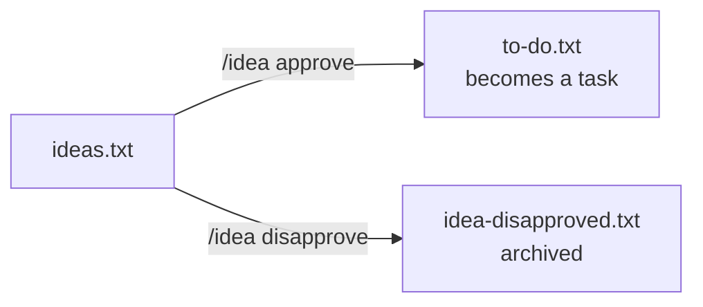
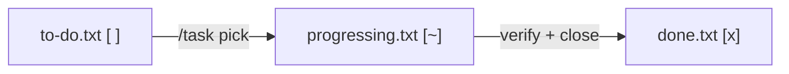
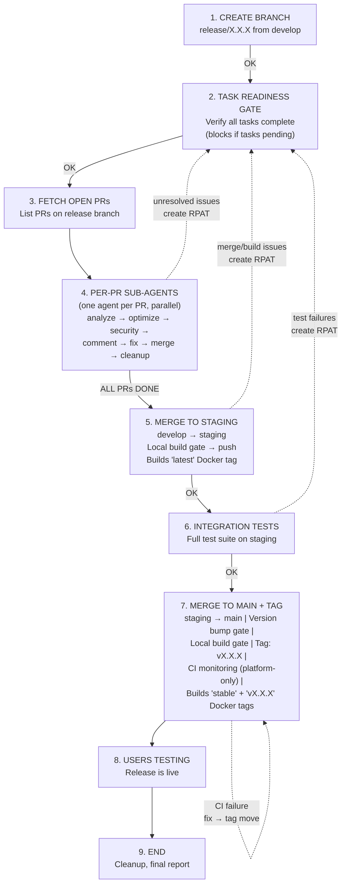
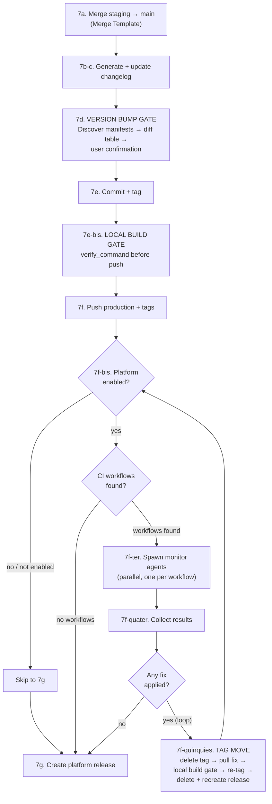
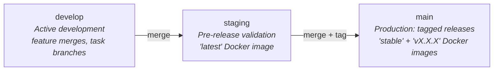

<p align="center">
  <span style="display:inline-block;width:300px;height:300px;overflow:hidden;border-radius:60px;">
    
  </span>
</p>

<h1 align="center">🐾 CodeClaw</h1>

<p align="center">
  <em>A project-agnostic task and idea management plugin for <a href="https://docs.anthropic.com/en/docs/claude-code">Claude Code</a></em>
</p>

<p align="center">
  <a href="https://github.com/dnviti/claude-task-development-framework/releases/tag/v4.0.0"></a>
  <a href="LICENSE"></a>
  
  
</p>

---

CodeClaw gives your AI-assisted development workflow a structured backbone: ideas are captured, evaluated, promoted to tasks, implemented with quality gates, and tracked to completion — all through plain-text files and Claude Code slash commands. A gated release pipeline with parallel sub-agent orchestration enforces strict development rules from branch creation to production tagging.

> 📖 **[Full Documentation](docs/index.md)** — Architecture, API reference, configuration, deployment, troubleshooting, and more.

## ✨ Features

- 🔄 **Two-pipeline workflow** — separate idea evaluation from task execution
- 🛠️ **8 streamlined skills** — unified slash commands (`/task`, `/idea`, `/release`, `/docs`, `/setup`, `/update`, `/tests`, `/help`)
- 🚦 **Gated release pipeline** — 9 sequential stages with user-confirmed gates, feedback loops, parallel sub-agents, and mandatory local build verification before every push
- 🤖 **Per-PR sub-agent analysis** — each PR gets an independent agent for code optimization, security scanning, fix application, and automated merge
- 📡 **Post-tag CI monitoring** — parallel agents monitor remote CI after tagging, auto-fix failures, and move tags when needed (platform-only)
- 🏷️ **Explicit version bump gate** — all manifest files are discovered, verified, and updated with user confirmation before tagging
- 🌿 **Three-branch strategy** — enforced `develop` → `staging` → `main` promotion path with mandatory staging validation
- 🐳 **Docker tagging** — staging builds the `latest` tag, production builds `stable` + versioned tags
- 🧩 **Claude Code plugin** — install via marketplace, uninstall cleanly, update easily
- 📝 **Plain-text tracking** — tasks and ideas live in simple `.txt` files, fully version-controllable
- 🔗 **GitHub/GitLab Issues integration** — optional tri-modal sync with GitHub or GitLab Issues
- ✅ **Quality gates** — verification, linting, and smoke tests run before tasks can be closed
- 💻 **Cross-platform** — works on Linux, macOS, and Windows with automatic OS detection
- 🌐 **Project-agnostic** — works with any language, framework, or tech stack
- 👤 **Human-in-the-loop** — AI assists, but you make every decision at every gate
- ⚡ **Yolo mode** — append `yolo` to any command to auto-confirm all gates for fully autonomous execution

### 🆕 What's New in v4.0.0

- 🧠 **Unified memory orchestrator** — tandem multi-backend coordination (LanceDB + SQLite FTS5 + RLM)
- 🔍 **Semantic intelligence** — /task, /idea, /docs, /tests, /help skills powered by vector search
- 🤖 **[BETA] /crazy skill** — fully autonomous end-to-end project builder
- 🖼️ **Image generation** — on-demand with 4 provider backends (DALL-E, Replicate, Stability AI, local)
- 🎨 **Frontend design wizard** — template search, theme selection, color palette picker
- 🔒 **Security hardened** — 209 findings analyzed, 133 fixes applied across 20 PRs by parallel sub-agents
- 🐾 **Rebranded** — CTDF → CodeClaw with plugin id `claw`

## 📋 Prerequisites

- [Claude Code CLI](https://docs.anthropic.com/en/docs/claude-code) installed and configured
- 🐍 Python 3.12+ (used by the bundled scripts)

## 📦 Installation

### From Marketplace

```
/plugin marketplace add https://github.com/dnviti/codeclaw
/plugin install claw@dnviti-plugins
```

### Local Development

```bash
git clone https://github.com/dnviti/codeclaw.git
claude --plugin-dir ./codeclaw
```

## 🚀 Getting Started

1. **Install the plugin** using one of the methods above.

2. **Set up task tracking** in your project:

   ```
   /setup My Project Name
   ```

   This creates the task/idea files (`to-do.txt`, `progressing.txt`, `done.txt`, `ideas.txt`, `idea-disapproved.txt`), configures the three-branch strategy, and adds framework guidance to your `CLAUDE.md`.

3. **Start using skills:**

   ```
   /idea create Add user authentication with JWT
   /idea approve IDEA-AUTH-0001
   /task pick
   /task status
   ```

4. **When ready to release:**

   ```
   /release continue 1.0.0
   ```

## ⚙️ How It Works

CodeClaw enforces strict development rules through two connected pipelines and a gated release process.

### 💡 Idea Pipeline

Ideas are lightweight proposals — *what* and *why* only. They must be explicitly approved before entering the task pipeline.



### 📋 Task Pipeline

Tasks are actionable work items with technical details, file lists, and dependencies. Each task gets a dedicated branch for isolated development.



### 🚀 Release Pipeline — Flow Diagram

The release pipeline enforces a strict sequential process with built-in feedback loops. Every stage is gated — the release advances only when the stage passes ("OK"). Issues found at any stage create patch tasks (RPAT) that loop back to Stage 2.



### 🔧 Stage 7 — Internal Flow Detail

Stage 7 contains multiple sub-gates including version bumping, local build verification, and conditional CI monitoring with a tag-move self-healing loop.



### 🔁 Feedback Loop Summary

| Stage | Issues go to | Then loops back to |
|---|---|---|
| 🤖 Per-PR Sub-Agent (unresolved) | Release Patches (RPAT) | Task Readiness Gate |
| 🔀 Merge to Staging | Release Patches (RPAT) | Task Readiness Gate |
| 🧪 Integration Tests | Release Patches (RPAT) | Task Readiness Gate |
| 🏗️ Local build pre-push (5 / 7) | RPAT task | Task Readiness Gate |
| 📡 Post-Tag CI Monitor (7f) | Fix → PR → merge → tag move | CI Monitor (7f-bis), same stage |

### 📏 Key Rules Enforced

1. 🚦 **Stages are sequential and gated** — never skip a stage without explicit user override at a GATE.
2. 🚫 **The release pipeline never implements tasks** — Stage 2 is a readiness gate that blocks if any tasks are pending. Users must implement tasks via `/task pick` (or `/task pick all`) before the release can proceed.
3. 🤖 **Sub-agents run in parallel, one per PR** — each follows the full analyze → optimize → security → comment → fix → merge → cleanup sequence.
4. 🔧 **Sub-agents fix what they can, escalate what they can't** — unresolved issues become RPAT tasks and loop back.
5. 📝 **Every PR comment is structured** — findings and fixes are posted as separate, labeled comments for audit trail.
6. 🔒 **Staging = Main minus public visibility** — if it wouldn't survive on main, it doesn't pass staging.
7. 🏷️ **Tags are only created on the production branch** — after full pipeline through staging.
8. 🔄 **Loop counter enforced** — warnings at 3 iterations, forced choice at 5. Prevents infinite loops.
9. ✅ **Local build and tests must pass before any push** — catches regressions from version bump commits or post-merge changes.
10. 🏷️ **Tags are moved, never recreated** — when post-tag CI fixes are needed: delete tag → pull fix → rebuild → re-tag → delete and recreate platform release.
11. 📦 **Version fields in all manifests must be bumped before tagging** — explicit gate with user confirmation at Step 7d.
12. 📡 **Remote CI monitoring is platform-only** — without a connected platform, local build success is the sole pre-release gate.

### 🌿 Branch Strategy



### 🐳 Docker Tagging Strategy

| Branch | Trigger | Docker Tags Built |
|--------|---------|-------------------|
| `staging` | Push to staging | `latest` |
| `main` | Release tag push (`v*`) | `stable`, `vX.X.X` |

## 🛠️ Skills Reference

### ⚙️ Setup & Project

| Skill | Usage | Description |
|-------|-------|-------------|
| `/setup` | `/setup [project name]` | Initialize task/idea tracking, branches, CI/CD, and issues integration |
| `/setup env` | `/setup env [section]` | Scan project to detect tech stack, dependencies, and commands; update CLAUDE.md |
| `/setup init` | `/setup init [purpose]` | Full project scaffold: choose stack, configure git, adapt all skills |
| `/setup branch-strategy` | `/setup branch-strategy` | Configure develop/staging/main branch strategy |
| `/setup agentic-fleet` | `/setup agentic-fleet` | Set up AI-powered CI/CD pipelines for idea scouting and task implementation |
| `/update` | `/update [category]` | Update CodeClaw-managed files (pipelines, scripts, prompts, skills, CLAUDE.md) to the latest plugin version |

### 📋 Task Management

| Skill | Usage | Description |
|-------|-------|-------------|
| `/task pick` | `/task pick [CODE]` | Pick up the next task — creates branch, presents briefing, runs quality gates |
| `/task pick all` | `/task pick all [sequential]` | Pick up and implement all pending release tasks (parallel by default, `sequential` for one-at-a-time) |
| `/task create` | `/task create [description]` | Create a new task with auto-assigned ID and codebase-informed technical details |
| `/task create all` | `/task create all [sequential]` | Create tasks from all pending ideas (parallel by default) |
| `/task continue` | `/task continue [CODE]` | Resume work on a specific in-progress task |
| `/task continue all` | `/task continue all [sequential]` | Continue all in-progress tasks (parallel by default) |
| `/task schedule` | `/task schedule CODE [CODE2...] to X.X.X` | Assign task(s) to a release milestone |
| `/task status` | `/task status` | Show current task summary and recommend next tasks |
| `/task edit` | `/task edit [CODE]` | Edit task title, priority, description, or release assignment in-place |

### 💡 Idea Management

| Skill | Usage | Description |
|-------|-------|-------------|
| `/idea create` | `/idea create [description]` | Add a lightweight idea to the backlog for future evaluation |
| `/idea approve` | `/idea approve [IDEA-CODE]` | Promote an idea to a full task with technical details |
| `/idea disapprove` | `/idea disapprove [IDEA-CODE]` | Reject an idea and archive it |
| `/idea refactor` | `/idea refactor [IDEA-CODE]` | Update ideas to reflect codebase changes |
| `/idea scout` | `/idea scout [focus area]` | Research trends and online sources to suggest new ideas |
| `/idea edit` | `/idea edit [IDEA-CODE]` | Edit idea title, category, or description in-place |

### 🚀 Release

| Skill | Usage | Description |
|-------|-------|-------------|
| `/release create` | `/release create X.X.X` | Create an empty release milestone for task scheduling |
| `/release generate` | `/release generate` | Analyze pending tasks and auto-generate a release roadmap with milestones |
| `/release continue` | `/release continue X.X.X` | Full 9-stage release pipeline with task readiness gate, parallel PR sub-agents, staging validation, and production tagging |
| `/release continue resume` | `/release continue resume` | Resume a release pipeline from the last saved stage |
| `/release close` | `/release close X.X.X` | Finalize release: verify tasks, close milestone, cleanup |
| `/release security-only` | `/release security-only` | Run security analysis alone on the current branch |
| `/release test-only` | `/release test-only` | Run integration tests alone on the current branch |
| `/release edit` | `/release edit X.X.X` | Edit release theme, target date, or task assignments |

### 📖 Documentation & Testing

| Skill | Usage | Description |
|-------|-------|-------------|
| `/docs generate` | `/docs generate` | Analyze the entire codebase and generate full technical documentation from scratch |
| `/docs sync` | `/docs sync` | Update existing documentation based on latest code changes (called automatically during releases) |
| `/docs reset` | `/docs reset` | Remove all generated documentation files |
| `/docs publish` | `/docs publish` | Build and publish documentation as a static website from the Markdown source |
| `/tests` | `/tests` | Analyze test coverage, discover gaps, and generate meaningful tests |

### 🤖 Autonomous

| Skill | Usage | Description |
|-------|-------|-------------|
| `/crazy` | `/crazy [prompt]` | **[BETA]** Fully autonomous project builder — generates ideas, creates tasks, implements them, and runs the release pipeline hands-free |

## 🎯 Typical Workflow

```
0.  /setup "My Project"                     → 📁 Create tracking files + branches
1.  /idea create "Add email notifications"  → 💡 Idea added to ideas.txt
2.  /idea approve IDEA-NOTIF-0001           → ✅ Idea promoted to task in to-do.txt
3.  /release create 1.0.0                   → 🏷️ Create release milestone
4.  /task schedule NOTIF-0001 to 1.0.0      → 📌 Assign task to release
5.  /task pick                              → 🌿 Branch created, briefing presented
6.  (implement the task)                    → 💻 Write code on task branch
7.  /task pick                              → ✅ Verify, close task, create PR
8.  /release continue 1.0.0                 → 🚀 Full pipeline: tasks → PRs → staging → main
9.  /release close 1.0.0                    → 🎉 Finalize and close the release
```

Or go fully autonomous:

```
/release generate                           → 🗺️ Analyze tasks, propose milestones
/task pick all                              → ⚡ Implement all release tasks in parallel
/release continue 1.0.0 yolo                → 🤖 Run full pipeline autonomously
```

## 🔗 Issues Tracker Integration (Optional)

The plugin supports optional GitHub/GitLab Issues integration that can operate in three modes:

| `enabled` | `sync` | Mode | Data Source |
|-----------|--------|------|-------------|
| `true` | `false` | 🌐 **Platform-only** | GitHub/GitLab Issues only — no local text files |
| `true` | `true` | 🔄 **Dual sync** | Local files first, then synced to platform issues |
| `false` | — | 📝 **Local only** | Local `.txt` files only (default) |

To enable, run `/setup` and choose your platform when prompted, or manually configure:

```bash
cp <plugin-dir>/config/issues-tracker.example.json .claude/issues-tracker.json
# Edit .claude/issues-tracker.json with your repo and settings
```

## 🤖 Agentic Fleet Pipelines

CodeClaw includes automated CI/CD pipelines that use Claude Code to perform idea scouting and task implementation without human intervention.

| Pipeline | Trigger | What it does |
|----------|---------|--------------|
| 💡 **Idea Scout** | On release publish | Scans trends, documentation, and community sources to suggest new ideas |
| ⚙️ **Task Implementation** | Cron-based schedule | Picks up pending tasks, implements them on dedicated branches, and opens PRs |
| 📖 **Docs** | On release publish | Updates documentation based on code changes |

Each pipeline uses a **three-agent architecture**: Orchestrator, Worker, and Memory Builder. Supports both **GitHub Actions** and **GitLab CI/CD** with multiple AI providers (Claude, OpenAI Codex, OpenClaw).

```bash
/setup agentic-fleet
```

## 📄 Task Format

Each task in `to-do.txt` (or `progressing.txt` / `done.txt`) follows this structure:

```
------------------------------------------------------------------------------
[ ] AUTH-0001 — User Authentication System
------------------------------------------------------------------------------
  Priority: HIGH
  Dependencies: None

  DESCRIPTION:
  Implement user registration, login, and token-based authentication
  using JWT.

  TECHNICAL DETAILS:
  Backend:
    - POST /api/auth/register — validate input, hash password, store user
    - POST /api/auth/login — verify credentials, return JWT

  Files involved:
    CREATE:  src/services/auth.service.ts
    MODIFY:  src/app.ts
```

Key formatting rules: 78-dash separators, em dash (`—`) in title, 2-space indent, globally sequential task codes.

## 📂 Plugin Structure

```
codeclaw/
├── .claude-plugin/
│   ├── plugin.json              # 🧩 Plugin manifest
│   └── marketplace.json         # 🏪 Marketplace definition
├── skills/                      # 🛠️ 8 unified Claude Code skills
│   ├── setup/                   # ⚙️ Initialize, configure, scaffold projects
│   ├── update/                  # 🔄 Update CodeClaw-managed files
│   ├── task/                    # 📋 Pick, create, continue, edit, status
│   ├── idea/                    # 💡 Create, approve, disapprove, refactor, scout, edit
│   ├── release/                 # 🚀 Release management (create, generate, continue, close, edit)
│   ├── docs/                    # 📖 Documentation (generate, sync, reset, publish)
│   ├── tests/                   # 🧪 Test coverage analysis and generation
│   ├── help/                    # ❓ Semantic search over skills and documentation
│   └── crazy/                   # 🤖 [BETA] Autonomous project builder
├── scripts/                     # 🐍 Python automation scripts
│   ├── task_manager.py          # Task/idea management CLI
│   ├── release_manager.py       # Release automation CLI
│   ├── docs_manager.py          # Documentation lifecycle CLI
│   ├── skill_helper.py          # Skill dispatch and context resolution
│   ├── vector_memory.py         # Semantic indexing and search
│   ├── mcp_server.py            # Vector memory MCP server
│   ├── memory_orchestrator.py   # Multi-backend memory coordination
│   ├── sqlite_backend.py        # SQLite FTS5 + vec hybrid backend
│   ├── memory_event_log.py      # Event-sourced memory for concurrent writes
│   ├── memory_lock.py           # Distributed lock backends (file/SQLite/Redis)
│   ├── conflict_judge.py        # LLM-as-judge conflict resolution
│   ├── rlm_backend.py           # Recursive context processing
│   ├── image_generator.py       # Multi-provider image generation
│   ├── frontend_wizard.py       # Frontend design wizard
│   └── ollama_manager.py        # Local model offloading
├── templates/                   # 📝 CI/CD workflow templates
├── config/                      # ⚙️ Example configuration files
├── tests/                       # 🧪 Test suite
├── icons/                       # 🎨 Branding assets
├── CLAUDE.md                    # 📋 Framework guidance
└── README.md                    # 📖 This file
```

## 💻 Cross-Platform Notes

- 🐍 **Python command:** All scripts reference `python3`. On Windows where only `python` is available, CodeClaw auto-detects the correct command.
- 🔌 **Port management:** `app_manager.py` automatically uses the correct OS tools — `lsof`/`ss` on Unix, `netstat`/`taskkill` on Windows.
- 🔍 **File search:** `task_manager.py find-files` provides cross-platform file discovery.

## 🔧 Managing the Plugin

```bash
# 🔄 Update the plugin
/plugin update claw@dnviti-plugins

# After updating, refresh CodeClaw-managed files in your project
/update
```

```bash
# ⏸️ Disable temporarily
/plugin disable claw@dnviti-plugins

# ▶️ Re-enable
/plugin enable claw@dnviti-plugins

# 🗑️ Uninstall
/plugin uninstall claw@dnviti-plugins
```

## 📄 License

MIT License

Copyright (c) 2026

Permission is hereby granted, free of charge, to any person obtaining a copy
of this software and associated documentation files (the "Software"), to deal
in the Software without restriction, including without limitation the rights
to use, copy, modify, merge, publish, distribute, sublicense, and/or sell
copies of the Software, and to permit persons to whom the Software is
furnished to do so, subject to the following conditions:

The above copyright notice and this permission notice shall be included in all
copies or substantial portions of the Software.

THE SOFTWARE IS PROVIDED "AS IS", WITHOUT WARRANTY OF ANY KIND, EXPRESS OR
IMPLIED, INCLUDING BUT NOT LIMITED TO THE WARRANTIES OF MERCHANTABILITY,
FITNESS FOR A PARTICULAR PURPOSE AND NONINFRINGEMENT. IN NO EVENT SHALL THE
AUTHORS OR COPYRIGHT HOLDERS BE LIABLE FOR ANY CLAIM, DAMAGES OR OTHER
LIABILITY, WHETHER IN AN ACTION OF CONTRACT, TORT OR OTHERWISE, ARISING FROM,
OUT OF OR IN CONNECTION WITH THE SOFTWARE OR THE USE OR OTHER DEALINGS IN THE
SOFTWARE.
