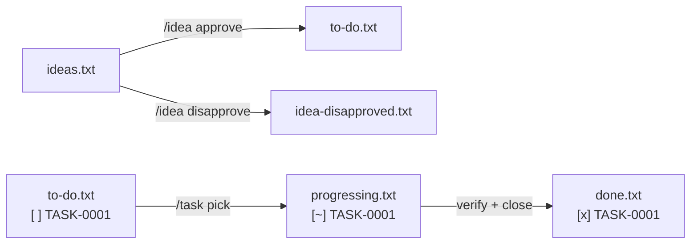
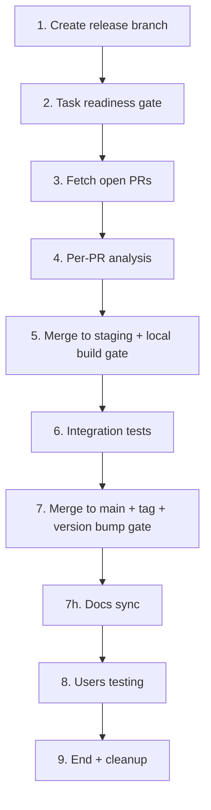
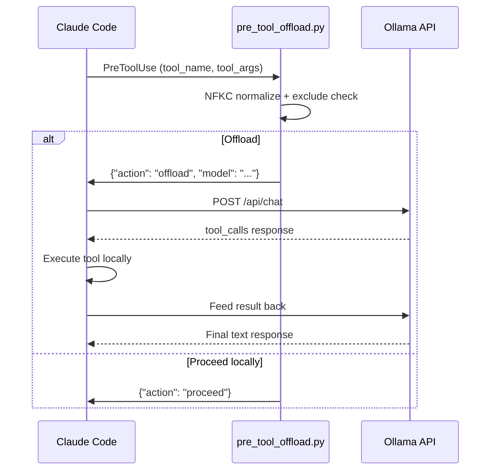
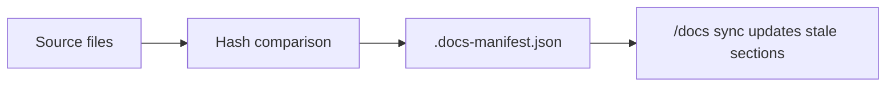
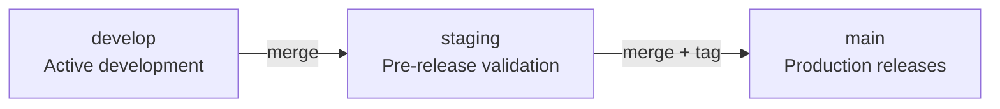

## Overview

CodeClaw is a project-agnostic Claude Code plugin that provides structured task management, idea evaluation, documentation generation, testing support, and a gated release pipeline. The core implementation is Python 3 standard library only. Optional Ollama integration adds local model routing, but the supported workflow does not depend on retired auxiliary tooling.

## Why This Architecture

CodeClaw separates concerns into three layers:

1. **Skills** define the AI-facing slash-command behavior in Markdown.
2. **Scripts** implement deterministic file I/O, parsing, versioning, and orchestration in Python.
3. **Hooks** connect Claude Code events to the correct script entry points.

This keeps the AI behavior declarative while the stateful operations remain explicit, testable, and cross-platform.

## Component Architecture

```mermaid
flowchart TD
    subgraph "Claude Code Plugin"
        PLUGIN["plugin.json<br>Plugin manifest"]
        HOOKS["hooks.json<br>PreToolUse + PostToolUse"]
    end

    subgraph "Skills Layer"
        S_TASK["/task"]
        S_IDEA["/idea"]
        S_REL["/release"]
        S_DOCS["/docs"]
        S_SETUP["/setup"]
        S_UPDATE["/update"]
        S_TESTS["/tests"]
        S_HELP["/help"]
        S_CRAZY["/crazy"]
    end

    subgraph "Scripts Layer"
        TM["task_manager.py<br>Task and idea CRUD"]
        RM["release_manager.py<br>Versioning and release state"]
        SH["skill_helper.py<br>Context and dispatch"]
        DM["docs_manager.py<br>Docs discovery and staleness"]
        TT["test_manager.py<br>Test discovery and analysis"]
        OM["ollama_manager.py<br>Local model routing"]
        BC["build_ccpkg.py<br>Package builder"]
        BP["build_portable.py<br>Portable archive builder"]
        SA["social_announcer.py<br>Release announcements"]
        CL["config_lock.py<br>Atomic config writes"]
        PA["platform_adapter.py<br>Platform abstraction"]
        PE["platform_exporter.py<br>Export and sync helpers"]
    end

    subgraph "Hooks"
        PRE["pre_tool_offload.py<br>PreToolUse routing"]
        POST["task_manager.py hook<br>PostToolUse file tracking"]
    end

    subgraph "Analyzers"
        A1["features.py"]
        A2["quality.py"]
        A3["infrastructure.py"]
        A4["coverage.py"]
    end

    PLUGIN --> S_TASK & S_IDEA & S_REL & S_DOCS & S_SETUP & S_UPDATE & S_TESTS & S_HELP & S_CRAZY
    HOOKS --> PRE & POST
    PRE --> OM
    POST --> TM
    S_TASK --> TM & SH
    S_IDEA --> TM & SH
    S_REL --> RM & SH & DM
    S_DOCS --> DM & SH
    S_SETUP --> SH & TM
    S_TESTS --> TT
    DM --> A1 & A2 & A3 & A4
    TT --> A2 & A4
    BC --> SH
    BP --> SH
    SA --> RM
    RM --> CL
    SH --> PA & PE
```

## Script Responsibilities

### task_manager.py

Manages the lifecycle of tasks and ideas through plain-text files and optional platform Issues sync.

**Key responsibilities:**
- Parse and manipulate task and idea blocks
- Generate sequential task and idea codes
- Move blocks between status files
- Track PostToolUse edits against in-progress tasks
- Integrate with GitHub/GitLab Issues in local, platform-only, or dual-sync modes

### release_manager.py

Manages the release lifecycle, changelog generation, manifest version bumps, and release state persistence.

**Key responsibilities:**
- Detect versions from supported manifests
- Parse conventional commits and suggest bumps
- Persist release state locally or in a platform issue
- Discover and update manifest versions during Stage 7d

### skill_helper.py

Shared helper that consolidates skill argument parsing, platform context, and branch detection.

**Key responsibilities:**
- Gather platform and branch context
- Dispatch skill arguments into flows
- Detect release configuration and project state
- Report task counts and in-progress work

### docs_manager.py

Documentation lifecycle manager.

**Key responsibilities:**
- Discover codebase structure and file roles
- Track docs staleness via SHA-256 hashes in `.docs-manifest.json`
- List documentation sections and status
- Diff changed files since a tag for release-triggered sync

### test_manager.py

Test lifecycle management with persistent coverage tracking.

**Key responsibilities:**
- Discover test files
- Analyze coverage gaps using local heuristics
- Suggest test targets ranked by priority
- Execute tests via the configured framework

### ollama_manager.py

Optional local model manager for tool routing and small task offloading.

**Key responsibilities:**
- Detect hardware and recommend a model tier
- Manage installation and model pulling
- Score tasks for offload suitability
- Execute the tool-calling loop against Ollama

### build_ccpkg.py

Builds the distributable `.ccpkg` archive from the current repository state.

### build_portable.py

Builds the portable ZIP distribution for non-CCP installation paths.

### social_announcer.py

Generates release announcements from changelog data and project context.

### pre_tool_offload.py

PreToolUse hook that decides whether a Claude Code tool call should be offloaded to Ollama.

**Key responsibilities:**
- Load Ollama routing configuration
- Apply NFKC normalization before command matching
- Emit a graceful `proceed` fallback on error

## Data Flow

### Task Lifecycle

### Release Pipeline

### Ollama Routing

### Docs Sync

## Plugin System

- `plugin.json` declares the plugin name, version, skills directory, and hook registration
- `marketplace.json` drives marketplace discovery
- `hooks.json` registers `PreToolUse` and `PostToolUse`
- `skills/<name>/SKILL.md` defines the AI behavior for each slash command

## Branch Strategy

- `develop` receives feature branches and task PRs
- `staging` is the pre-release validation branch
- `main` contains tagged production releases

## Issues Integration

Three operating modes are supported via `issues-tracker.json`:

- Local only
- Platform only
- Dual sync

When platform-only mode is enabled, the release state is stored in a `claw-release-state` issue so all collaborators share the same pipeline state.

## Cross-Platform Design

All scripts use `platform.system()` detection and keep platform-specific behavior isolated. Paths are normalized, hooks fail gracefully, and CLI behavior remains deterministic across Linux, macOS, and Windows.
