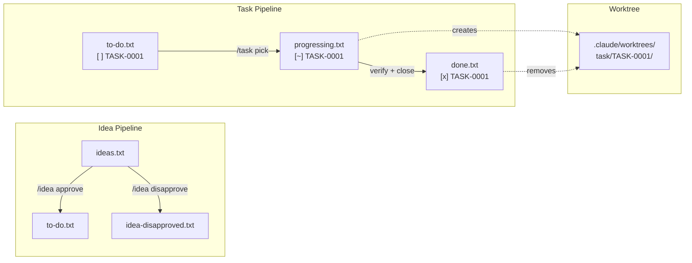
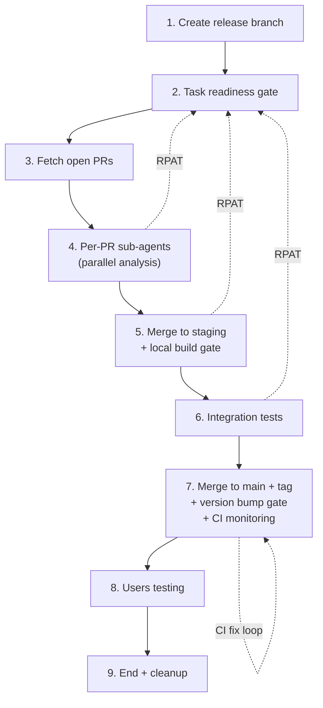
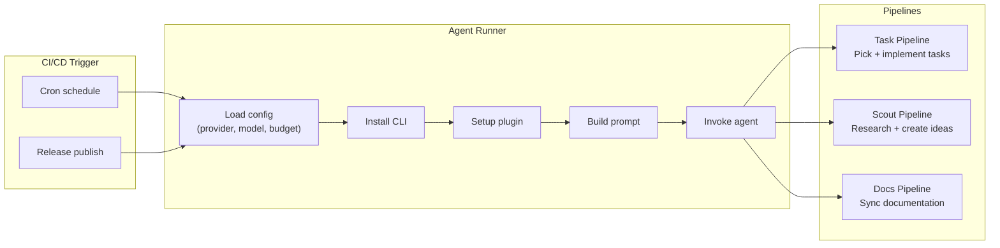
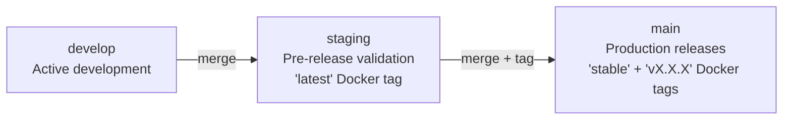
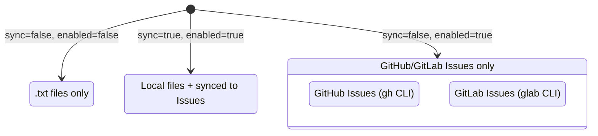

## Overview

CTDF (Claude Task Development Framework) is a project-agnostic plugin for Claude Code that provides structured task management, idea evaluation, gated release pipelines, documentation generation, and automated CI/CD via agentic fleet pipelines. It is built entirely in Python 3 using only the standard library (zero external dependencies).

## Why This Architecture

CTDF is designed to be a **zero-dependency, cross-platform plugin** that works with any language, framework, or tech stack. The architecture separates concerns into three layers:

1. **Skills** (natural language interface) — Claude Code slash commands that define the AI's behavior
2. **Scripts** (deterministic logic) — Python CLIs that handle file I/O, parsing, and state management
3. **Templates** (project scaffolding) — CI/CD workflows, prompts, and configuration files

This separation ensures that AI behavior is defined declaratively in Markdown skills, while all deterministic operations (file parsing, ID generation, version bumping) are handled by reliable Python scripts.

## Component Architecture

```mermaid
flowchart TD
    subgraph "Claude Code Plugin"
        PLUGIN["plugin.json<br>Plugin manifest"]
        HOOKS["hooks.json<br>PostToolUse hook"]
    end

    subgraph "Skills Layer"
        S_TASK["/task"]
        S_IDEA["/idea"]
        S_REL["/release"]
        S_DOCS["/docs"]
        S_SETUP["/setup"]
        S_UPDATE["/update"]
        S_TESTS["/tests"]
        S_HELP["/help"]
    end

    subgraph "Scripts Layer"
        TM["task_manager.py<br>Task/idea CRUD, hooks"]
        RM["release_manager.py<br>Version, changelog, state"]
        SH["skill_helper.py<br>Context, dispatch, worktrees"]
        DM["docs_manager.py<br>Discover, staleness, manifest"]
        AR["agent_runner.py<br>Multi-provider fleet runner"]
        AM["app_manager.py<br>Port/process management"]
        CA["codebase_analyzer.py<br>Static analysis reports"]
        MB["memory_builder.py<br>Codebase summary generator"]
        TT["test_manager.py<br>Test discovery, gaps, coverage"]
    end

    subgraph "Analyzers Subpackage"
        AI["__init__.py<br>File walking, classification"]
        AF["features.py<br>Feature analysis"]
        AQ["quality.py<br>Code quality analysis"]
        AINF["infrastructure.py<br>Infrastructure analysis"]
        AC["coverage.py<br>Coverage snapshots"]
    end

    subgraph "Templates"
        GH["GitHub Actions workflows"]
        GL["GitLab CI templates"]
        PR["Agentic prompts"]
        CMD["CLAUDE.md template"]
    end

    subgraph "Configuration"
        CFG_IT["issues-tracker.json"]
        CFG_PC["project-config.json"]
        CFG_RL["releases.json"]
        CFG_AP["agentic-provider.json"]
    end

    PLUGIN --> S_TASK & S_IDEA & S_REL & S_DOCS & S_SETUP & S_UPDATE & S_TESTS & S_HELP
    HOOKS --> TM

    S_TASK --> TM & SH
    S_IDEA --> TM & SH
    S_REL --> RM & TM & SH & DM
    S_DOCS --> DM & SH
    S_SETUP --> SH & TM
    S_TESTS --> TT

    CA --> AI & AF & AQ & AINF
    TT --> AI & AQ & AC
    DM --> AI
    AR --> PR

    S_SETUP --> GH & GL & CMD
    S_SETUP --> CFG_IT & CFG_PC & CFG_RL & CFG_AP
```

## Script Responsibilities

### task_manager.py

The largest script (~2000 lines). Manages the full lifecycle of tasks and ideas through plain-text files.

**Key responsibilities:**
- Parse and manipulate task/idea blocks in `to-do.txt`, `progressing.txt`, `done.txt`, `ideas.txt`, `idea-disapproved.txt`
- Generate globally sequential task codes (e.g., `AUTH-0001`) and idea codes (e.g., `IDEA-AUTH-0001`)
- Move blocks between files (pick, close, approve, disapprove)
- PostToolUse hook: correlates edited files to in-progress tasks
- Duplicate detection, file verification, section support
- GitHub/GitLab Issues integration (tri-modal: local-only, platform-only, dual-sync)

**CLI subcommands:** `list`, `parse-block`, `next-id`, `move-block`, `remove-block`, `add-block`, `verify-files`, `find-duplicates`, `hook`, `find-files`, `issue-create`, `issue-update`, `issue-close`, `issue-list`, `milestone-create`, `milestone-close`, `milestone-list`, `close-milestone`

### release_manager.py

Manages the release lifecycle including version detection, changelog generation, and release state persistence.

**Key responsibilities:**
- Detect current version from manifest files (`package.json`, `pyproject.toml`, `Cargo.toml`, etc.)
- Parse conventional commits and classify them into changelog categories
- Calculate semantic version bumps (major/minor/patch)
- Generate changelogs in Keep a Changelog format
- Persist release state across pipeline stages (`release-state-save`, `release-state-get`)
- Discover and bump version fields in all manifest files
- Milestone management (close with verification)

**CLI subcommands:** `current-version`, `classify-commits`, `next-version`, `generate-changelog`, `update-changelog`, `release-state-save`, `release-state-get`, `release-state-clear`, `discover-manifests`, `bump-version`, `close-milestone`

### skill_helper.py

Consolidated helper that eliminates repeated logic across all skills.

**Key responsibilities:**
- Gather platform context (GitHub/GitLab config, worktree state, branch config)
- Dispatch skill arguments (parse flow, yolo mode, task codes)
- Manage git worktrees for isolated task development
- Parse CLAUDE.md variables for project configuration
- Branch strategy detection and enforcement

**CLI subcommands:** `context`, `dispatch`, `worktree-create`, `worktree-cleanup`, `worktree-list`

### docs_manager.py

Manages the documentation lifecycle with hash-based staleness tracking.

**Key responsibilities:**
- Discover codebase structure (languages, frameworks, file roles)
- Track documentation staleness via SHA-256 hashes in `.docs-manifest.json`
- List documentation sections and their status
- Detect static site generators for publishing
- Diff changed files since a git tag for release-triggered sync

**CLI subcommands:** `discover`, `check-staleness`, `list-sections`, `init-manifest`, `clean`, `detect-site-generator`, `diff-since-tag`

### agent_runner.py

Multi-provider agent runner for automated CI/CD pipelines.

**Key responsibilities:**
- Abstract provider-specific CLI details (Claude, OpenAI Codex, OpenClaw)
- Build pipeline-specific prompts with platform placeholders
- Manage provider configuration with layered precedence (CLI > env > config > defaults)
- Install provider CLIs and set up the CTDF plugin
- Support three pipelines: task implementation, idea scouting, documentation sync

### test_manager.py

Test lifecycle management with persistent coverage tracking.

**Key responsibilities:**
- Discover test files across any project structure
- Analyze coverage gaps by matching source files to their tests
- Suggest test targets ranked by complexity, role, and recency
- Execute tests via auto-detected or configured frameworks
- Persistent coverage snapshots with regression detection and threshold checking

### Analyzers Subpackage

Deterministic static analysis replacing expensive LLM-based reader agents.

| Module | Purpose |
|--------|---------|
| `__init__.py` | File walking, gitignore handling, language/framework detection, role classification |
| `infrastructure.py` | Infrastructure analysis (Docker, CI/CD, deployment, environment) |
| `features.py` | Feature analysis (API endpoints, routes, components, services) |
| `quality.py` | Code quality analysis (test coverage, complexity, patterns) |
| `coverage.py` | Persistent coverage snapshot management and regression detection |

## Data Flow

### Task Lifecycle

### Release Pipeline

### Agentic Fleet Pipeline

## Plugin System

CTDF integrates with Claude Code via the plugin system:

- **`plugin.json`** — Declares the plugin name (`ctdf`), version, and skills directory
- **`marketplace.json`** — Marketplace listing for discovery and installation
- **`hooks.json`** — Registers a `PostToolUse` hook on `Edit|Write` events that calls `task_manager.py hook` to correlate file changes with in-progress tasks
- **Skills** — Each skill is a `SKILL.md` file in `skills/<name>/` that defines the AI's behavior as a Markdown document with structured instructions

## Branch Strategy

The three-branch strategy enforces a strict promotion path:
- **develop** — All feature branches merge here via PRs
- **staging** — Pre-release validation; builds the `latest` Docker image
- **main** — Production; tagged releases build `stable` + versioned Docker images

## Issues Integration Architecture

Three operational modes controlled by `issues-tracker.json`:
- **Local only** (default) — Tasks/ideas in plain `.txt` files
- **Platform only** — GitHub/GitLab Issues as the sole data source
- **Dual sync** — Local files as primary, synced to platform Issues

## Cross-Platform Design

All scripts use `platform.system()` detection and dispatch to platform-specific implementations:
- **Port management** — `lsof`/`ss` on Unix, `netstat`/`taskkill` on Windows
- **File paths** — Forward-slash normalization throughout
- **Python command** — Scripts reference `python3`; Windows users substitute `python`
- **CLI tools** — `gh` (GitHub) or `glab` (GitLab) based on configuration
