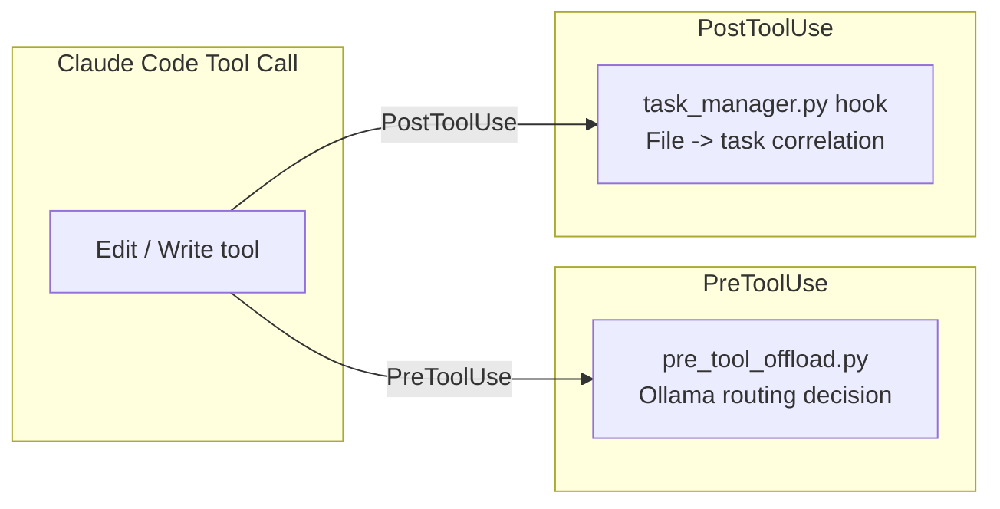
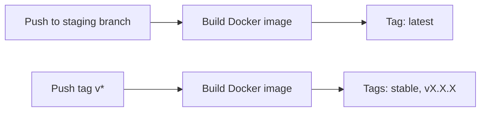
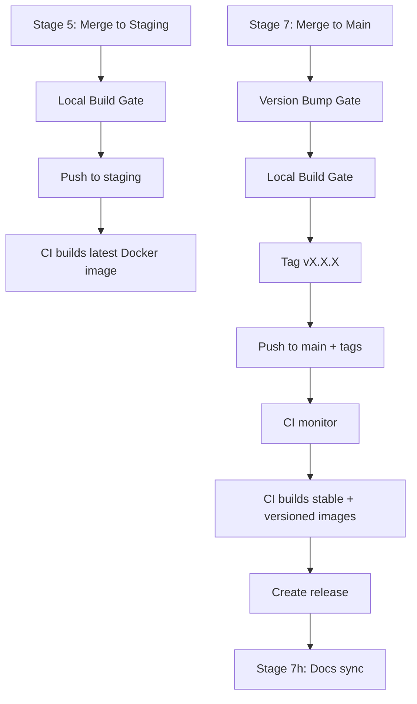

## Overview

CodeClaw ships CI/CD templates for GitHub Actions and GitLab CI/CD. The supported deployment story is intentionally narrow: lint/test/build checks, staging validation, release tagging, and docs sync. Legacy automation hooks are no longer part of the public deployment surface.

## CodeClaw's Own CI/CD

### CI Pipeline

The repository itself runs a cross-platform CI workflow on pull requests to `develop`, `staging`, and `main`.

**Key features:**
- Read-only contents permissions with write access to pull requests
- Cross-platform matrix for Linux, macOS, and Windows
- Python 3.12 setup with pip cache
- Lint, syntax check, and test execution

### Release Pipeline

The release workflow triggers on pushes to `main` and on manual dispatch. It:
1. Reads the version from `.claude-plugin/plugin.json`
2. Checks whether the tag already exists
3. Generates release notes from commit history
4. Creates a zip archive of the repository
5. Tags and publishes a GitHub Release

## Template Workflows for Your Project

### GitHub Actions Templates

| Template | Trigger | Purpose |
|----------|---------|---------|
| `ci.yml` | PR to main/develop/staging | Lint, test, and build |
| `release.yml` | Workflow dispatch or main push | Create a tagged release |
| `staging-merge.yml` | Push to staging | Build and push the `latest` Docker image |
| `security.yml` | Schedule or manual | Security scanning |

### GitLab CI Templates

| Template | Trigger | Purpose |
|----------|---------|---------|
| `staging-merge.gitlab-ci.yml` | Merge to staging | Build and push Docker images |

## Hook System in Production



- `pre_tool_offload.py` routes eligible tool calls to Ollama and always fails open
- `task_manager.py hook` correlates every edited file to the in-progress task

## Docker Tagging Strategy



| Branch | Trigger | Docker Tags |
|--------|---------|-------------|
| `staging` | Push to staging | `latest` |
| `main` | Release tag push (`v*`) | `stable`, `vX.X.X` |

## Release Pipeline Deployment Flow



### Local Build Gate

Before any push in Stages 5 or 7, the release pipeline runs the configured `verify_command` locally. This catches version bump regressions, compile errors, and missing dependency issues before the branch is promoted.

### Docs Sync

Stage 7h runs `/docs sync` so the generated documentation stays aligned with the release line.

## Setup Commands

### Install Templates

```bash
/setup init
```

Copies CI/CD templates to your project and replaces placeholders with detected stack values.

### Configure Branch Strategy

```bash
/setup branch-strategy
```

Configures the `develop` → `staging` → `main` promotion path and the related release settings.
