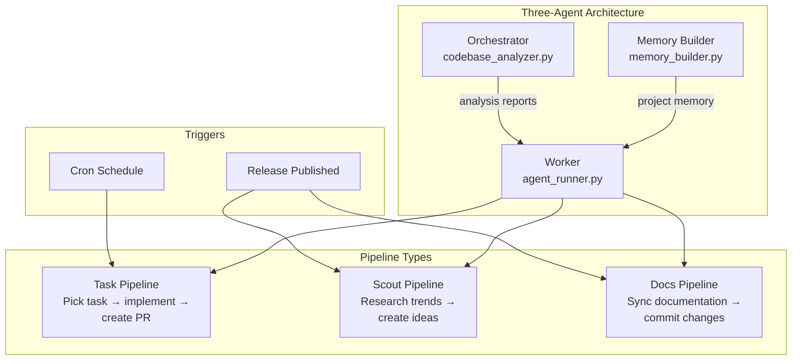
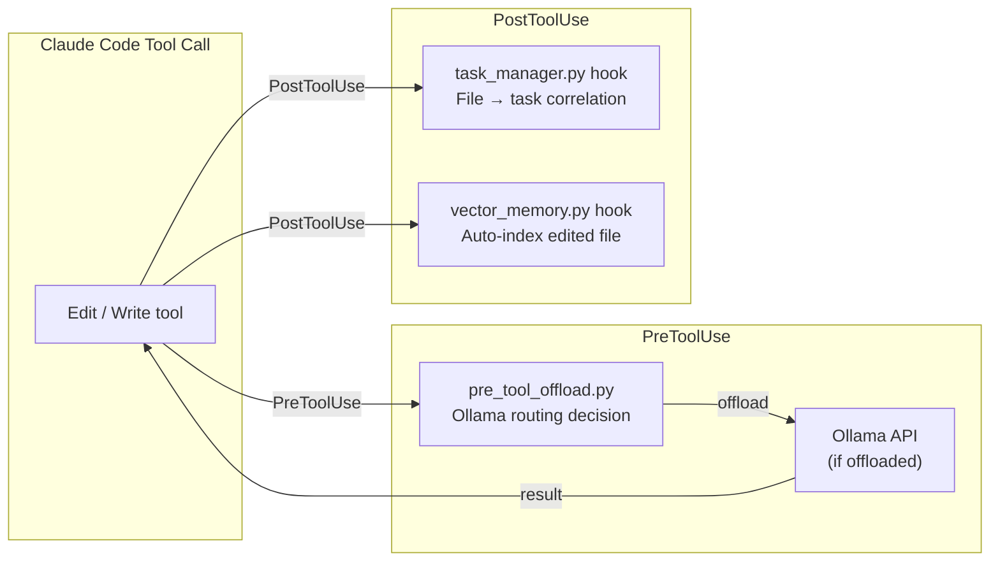
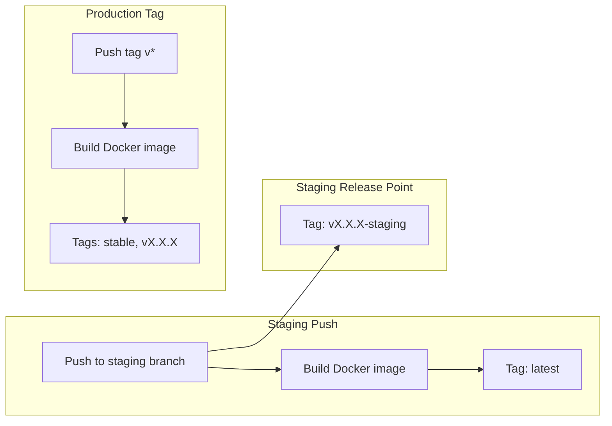
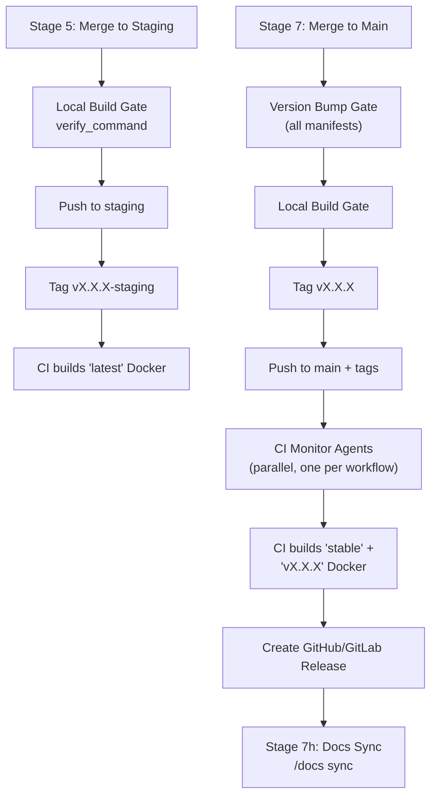

## Overview

CodeClaw provides CI/CD pipeline templates for both GitHub Actions and GitLab CI/CD. These templates are copied into your project during `/setup init` or `/setup agentic-fleet` and can be customized for your stack.

## CodeClaw's Own CI/CD

The CodeClaw plugin itself uses two GitHub Actions workflows:

### CI Pipeline (`.github/workflows/ci.yml`)

Runs on pull requests to `main`, `develop`, and `staging` branches, and on merge group check requests. Configured for Python 3.12 with a cross-platform matrix (Ubuntu, macOS, Windows) using `fail-fast: false`.

**Key features:**
- **Permissions:** Read-only `contents`, write access to `pull-requests`
- **Concurrency:** Groups runs by ref (`ci-${{ github.ref }}`) with `cancel-in-progress: true`
- **Cross-platform Python detection:** Separate detection steps for Unix and Windows, merged into a unified `py` output step
- **Steps:** Checkout (pinned SHA) → Setup Python (with pip cache) → Detect Python command → Install dependencies → Lint (flake8) → Syntax check core scripts → Run tests (pytest)

### Release Pipeline (`.github/workflows/release.yml`)

Triggers on manual `workflow_dispatch` or pushes to `main` that modify plugin-relevant paths (`skills/`, `scripts/`, `config/`, `templates/`, `hooks/`, `CLAUDE.md`). Automatically:

1. Reads version from `.claude-plugin/plugin.json` (with `fetch-depth: 0` for full history)
2. Checks if the tag already exists
3. Generates release notes from commit history (comparing from previous tag)
4. Creates a zip archive of the repository (`codeclaw-<version>.zip`)
5. Tags and creates a GitHub Release with the archive
6. Skips with a warning if the tag already exists (prompts to bump version in `plugin.json`)

## Template Workflows for Your Project

### GitHub Actions Templates

Located in `templates/github/workflows/`:

| Template | Trigger | Purpose |
|----------|---------|---------|
| `ci.yml` | PR to main/develop/staging, merge group | Lint, test, build (cross-platform matrix) |
| `release.yml` | Workflow dispatch or main push | Create tagged release with notes and zip archive |
| `staging-merge.yml` | Push to staging | Build and push `latest` Docker image |
| `security.yml` | Schedule or manual | Security scanning |
| `agentic-fleet.yml` | Release publish | Orchestrates scout and docs pipelines |
| `agentic-task.yml` | Cron schedule | Autonomous task implementation |
| `agentic-docs.yml` | Release publish | Autonomous documentation sync |
| `issue-triage.yml` | Issue/PR events | Auto-label and triage |
| `status-guard.yml` | Status events | Guard branch protections |

### GitLab CI Templates

Located in `templates/gitlab/`:

| Template | Trigger | Purpose |
|----------|---------|---------|
| `agentic-fleet.gitlab-ci.yml` | Release | Orchestrates scout and docs pipelines |
| `agentic-task.gitlab-ci.yml` | Schedule | Autonomous task implementation |
| `agentic-docs.gitlab-ci.yml` | Release | Autonomous documentation sync |
| `staging-merge.gitlab-ci.yml` | Merge to staging | Build and push Docker images |

## Agentic Fleet Pipelines

The agentic fleet uses AI agents in CI/CD to automate development tasks.



### Provider Support

| Provider | CLI | Task Model | Scout/Docs Model | Budget |
|----------|-----|------------|-------------------|--------|
| Claude | `claude` | `claude-opus-4-6` | `claude-sonnet-4-6` | Configurable USD |
| OpenAI | `codex` | `o3` | `o3-mini` | N/A |
| Ollama | local | Configured model | Configured model | N/A |

### Required Secrets

| Secret | Provider | Purpose |
|--------|----------|---------|
| `ANTHROPIC_API_KEY` | Claude | API authentication |
| `OPENAI_API_KEY` | OpenAI | API authentication |
| `GH_TOKEN` / `GITHUB_TOKEN` | All | Repository access |

## Hook System in Production

Two hooks run on every file edit/write operation:



- **`pre_tool_offload.py`** — Routes eligible tool calls to a local Ollama model. Applies NFKC normalization to prevent Unicode bypass of exclude patterns.
- **`task_manager.py hook`** — Correlates every edited file to the in-progress task for change tracking.
- **`vector_memory.py hook`** — Re-embeds and upserts the modified file into the LanceDB vector index for semantic search.

## Docker Tagging Strategy



| Branch | Trigger | Docker Tags |
|--------|---------|-------------|
| `staging` | Push to staging | `latest` |
| `staging` | Release pipeline Stage 5g | `vX.X.X-staging` (marks staging release point) |
| `main` | Release tag push (`v*`) | `stable`, `vX.X.X` |

> **Note:** Staging tags use a `-staging` suffix to avoid colliding with production tags. The `get_latest_tag()` function in `release_manager.py` filters out `-staging` tags when determining the latest production version.

## Release Pipeline Deployment Flow

The `/release continue` command executes a 9-stage pipeline with built-in deployment steps:



### Local Build Gate

Before any push (staging or production), the release pipeline runs the configured `verify_command` locally. This catches:
- Version bump regressions
- Post-merge compilation errors
- Missing dependency issues

If no `verify_command` is configured, the build gate is skipped (with a warning).

### CI Monitoring (Platform-Only)

After tagging, parallel monitor agents watch each CI workflow:
1. Detect workflow runs triggered by the tag push
2. Poll for completion every 30 seconds
3. If a workflow fails: analyze failure logs, create a fix, commit and push, open a PR, merge
4. Move the tag: delete old tag → pull fix → run local build gate → re-tag at new HEAD → push → delete platform release → recreate release

## Setup Commands

### Install Templates

```
/setup init
```

Copies CI/CD templates to your project and replaces placeholders with detected stack values.

### Configure Agentic Fleet

```
/setup agentic-fleet
```

Guides you through:
1. Selecting an AI provider (Claude, OpenAI, Ollama)
2. Configuring models and budgets
3. Copying workflow files
4. Setting up prompt templates
5. Configuring repository secrets
