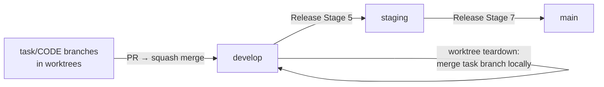

## Overview

CodeClaw is developed using its own workflow: ideas are captured, evaluated, promoted to tasks, implemented in worktrees, and released through the gated pipeline.

## Local Development Setup

### Clone and Run

```bash
git clone https://github.com/dnviti/codeclaw.git
cd codeclaw

# Run Claude Code with the local plugin
claude --plugin-dir .
```

### Requirements

- **Python 3.12+** — All scripts use stdlib only (no pip install needed for core features)
- **Claude Code CLI** — The host application
- **Git** — For worktree management and branch strategy
- **`gh` CLI** (optional) — For GitHub Issues integration testing

**Optional (for vector memory development):**
```bash
pip install lancedb onnxruntime tokenizers numpy pyarrow mcp
```

### Project Structure

```
codeclaw/
├── .claude-plugin/
│   ├── plugin.json              # Plugin manifest (name, version, skills path)
│   └── marketplace.json         # Marketplace listing
├── skills/                      # 9 Claude Code skills (SKILL.md each)
│   ├── task/                    # Task management
│   ├── idea/                    # Idea management
│   ├── release/                 # Release pipeline
│   ├── docs/                    # Documentation lifecycle
│   ├── setup/                   # Project setup and configuration
│   ├── update/                  # Plugin file updates
│   ├── tests/                   # Test management
│   ├── help/                    # Help and usage
│   └── crazy/                   # [BETA] Autonomous project builder
├── scripts/                     # Python automation (stdlib only)
│   ├── task_manager.py          # Task/idea CRUD, hooks, platform sync
│   ├── release_manager.py       # Version, changelog, state, platform release state
│   ├── skill_helper.py          # Context, dispatch, worktrees
│   ├── docs_manager.py          # Documentation lifecycle
│   ├── agent_runner.py          # Multi-provider fleet runner
│   ├── app_manager.py           # Port/process management
│   ├── codebase_analyzer.py     # Static analysis reports
│   ├── memory_builder.py        # Codebase summary generator
│   ├── test_manager.py          # Test discovery, gaps, coverage
│   ├── ollama_manager.py        # Local model routing + tool calling
│   ├── vector_memory.py         # Semantic indexing and search
│   ├── mcp_server.py            # Vector memory MCP server
│   ├── memory_orchestrator.py   # Multi-backend memory coordination
│   ├── sqlite_backend.py        # SQLite FTS5 + vec hybrid backend
│   ├── memory_event_log.py      # Event-sourced memory for concurrent writes
│   ├── memory_lock.py           # Distributed lock backends (file/SQLite/Redis)
│   ├── conflict_judge.py        # LLM-as-judge conflict resolution
│   ├── rlm_backend.py           # Recursive context processing
│   ├── image_generator.py       # Multi-provider image generation
│   ├── frontend_wizard.py       # Frontend design wizard
│   ├── setup_labels.py          # Platform label creation
│   ├── setup_protection.py      # Branch protection rules
│   ├── adapters/                # Platform adapters (claude_code, opencode, openclaw)
│   ├── chunkers/                # Text chunking for vector memory
│   ├── embeddings/              # Embedding providers (local ONNX, API)
│   ├── mcp_tools/               # MCP server tool definitions
│   ├── social_platforms/        # Social media posting adapters
│   ├── hooks/
│   │   └── pre_tool_offload.py  # PreToolUse hook: Ollama routing
│   └── analyzers/               # Static analysis subpackage
│       ├── __init__.py          # File walking, classification
│       ├── infrastructure.py    # Infrastructure analysis
│       ├── features.py          # Feature analysis
│       ├── quality.py           # Code quality analysis
│       └── coverage.py          # Coverage snapshots
├── templates/                   # CI/CD and config templates
│   ├── github/workflows/        # 9 GitHub Actions templates
│   ├── gitlab/                  # 4 GitLab CI templates
│   ├── prompts/                 # Agentic fleet prompt templates
│   └── CLAUDE.md                # CLAUDE.md template
├── config/                      # Example configuration files
│   ├── project-config.example.json
│   ├── ollama-config.example.json
│   ├── issues-tracker.example.json
│   └── ...
├── hooks/
│   └── hooks.json               # PreToolUse + PostToolUse hook definitions
├── docs/                        # Generated documentation (this directory)
├── CLAUDE.md                    # Framework guidance
└── README.md                    # Project documentation
```

## Coding Conventions

### Python Scripts

- **Zero external dependencies** — All scripts use Python 3 stdlib only (optional packages for vector memory)
- **JSON output** — Every script subcommand outputs JSON to stdout
- **Cross-platform** — Use `platform.system()` for OS-specific behavior
- **CLI via argparse** — Every script has a proper CLI with subcommands
- **Idempotent operations** — Label creation, branch protection, etc. are safe to re-run
- **Error handling** — Return JSON `{"error": "message"}` on failure; hooks always exit 0 (graceful degradation)
- **Unicode safety** — Apply `unicodedata.normalize('NFKC', s)` before pattern matching on user-supplied strings

### Skills (SKILL.md)

- Written in Markdown with structured headings
- Define AI behavior declaratively
- Reference scripts via `${CLAUDE_PLUGIN_ROOT}/scripts/` paths
- Use `$ARGUMENTS` placeholder for user input
- Gates (AskUserQuestion) for user confirmation at critical decision points

### Hook Development

Two types of hooks are registered in `hooks/hooks.json`:

**PreToolUse** — fires before Claude executes a tool:
- Handler: `scripts/hooks/pre_tool_offload.py`
- Must always exit 0 (never block Claude on errors)
- Outputs `{"action": "proceed"}` or `{"action": "offload", ...}`
- Apply NFKC normalization to all user-supplied pattern matching

**PostToolUse** — fires after Claude executes a tool:
- Two handlers run: `task_manager.py hook` and `vector_memory.py hook`
- Both receive `$CLAUDE_FILE_PATH` (the edited file path)

To test hook behavior locally:
```bash
# PostToolUse
python3 scripts/task_manager.py hook "src/example.ts"
python3 scripts/vector_memory.py hook "src/example.ts"

# PreToolUse
python3 scripts/hooks/pre_tool_offload.py Bash "git status"
python3 scripts/hooks/pre_tool_offload.py Bash "git push"  # should be excluded
```

### Task Format

Tasks follow a strict plain-text format:

```
------------------------------------------------------------------------------
[ ] AUTH-0001 — User Authentication System
------------------------------------------------------------------------------
  Priority: HIGH
  Dependencies: None

  DESCRIPTION:
  Implement user registration and login.

  TECHNICAL DETAILS:
  Backend:
    - POST /api/auth/register
    - POST /api/auth/login

  Files involved:
    CREATE:  src/services/auth.service.ts
    MODIFY:  src/app.ts
```

Key rules:
- 78-dash separators
- Em dash (`—`) in title line
- 2-space indent for body
- Status markers: `[ ]` todo, `[~]` progressing, `[x]` done, `[!]` blocked
- Globally sequential codes: 3-5 uppercase letters + 4-digit number

## Branch Strategy



- **Feature branches** — Created per-task in worktrees at `.worktrees/task/<code>/`, named `task/<code>`
- **develop** — Active development; all feature PRs target here. On worktree teardown, the task branch is merged into local develop before the worktree is removed
- **staging** — Pre-release validation; tagged `vX.X.X-staging`
- **main** — Production releases with semantic version tags `vX.X.X`

## Testing

### Running Tests on Target Projects

CodeClaw provides test management through the `/tests` skill and `test_manager.py`:

```bash
# Discover test files
python3 scripts/test_manager.py discover --root /path/to/project

# Analyze coverage gaps
python3 scripts/test_manager.py analyze-gaps --root /path/to/project

# Get test suggestions ranked by priority
python3 scripts/test_manager.py suggest --root /path/to/project

# Run tests
python3 scripts/test_manager.py run --root /path/to/project
```

### Coverage Tracking

```bash
# Take a coverage snapshot
python3 scripts/test_manager.py coverage snapshot --root /path/to/project

# Compare snapshots for regressions
python3 scripts/test_manager.py coverage compare --root /path/to/project

# Check against threshold
python3 scripts/test_manager.py coverage threshold-check --root /path/to/project --min-coverage 80
```

## Version Management

The plugin version lives in two files:
- `.claude-plugin/plugin.json` — `"version"` field
- `.claude-plugin/marketplace.json` — `"version"` field in the plugins array

During releases, the `/release continue` pipeline discovers all manifest files and bumps their version fields at Stage 7d with user confirmation. The `update-versions` command in `release_manager.py` handles this automatically.

## Vector Memory Development

The vector memory system (`scripts/vector_memory.py`) requires optional packages:

```bash
pip install lancedb onnxruntime tokenizers numpy pyarrow mcp
```

Key behaviors:
- **Unified memory orchestrator** — Multi-backend coordination via `memory_orchestrator.py` (LanceDB + SQLite FTS5 + RLM)
- **MCP server** — `mcp_server.py` provides semantic search, indexing, memory storage, and task context tools via stdio transport
- **Garbage collection** — Run `python3 scripts/vector_memory.py gc --json` to prune stale entries
- **Index location** — `.claude/memory/vectors` (gitignored via `.gitignore`)

## Ollama Integration Development

The Ollama integration (`scripts/ollama_manager.py`) is zero-dependency for core routing but requires Ollama to be running for actual inference.

Key design decisions:
- **NFKC normalization** — All command strings are NFKC-normalized before exclude-pattern matching to prevent Unicode homoglyph bypass (e.g., fullwidth space U+3000 in `git　push`)
- **Tool calling loop** — Full `/api/chat` loop: send tool call → parse `tool_calls` response → invoke tool → feed result → repeat until text response
- **Offloading levels 0–10** — Each level enables a different category of tool calls; level 10 routes everything except always-excluded patterns (git push, rm -rf, sudo, etc.)

## Workflow for Contributing

1. Create an idea: `/idea create [description]`
2. Approve it: `/idea approve [ID]`
3. Pick the task: `/task pick [CODE]`
4. Implement in the worktree (vector memory indexes your changes in real time)
5. Close the task: confirm via the task completion gate
6. PR is created automatically; worktree is removed (task branch merged into local develop)
7. Release: `/release continue X.X.X`
