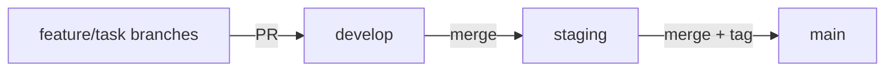

## Overview

CTDF is developed using its own workflow: ideas are captured, evaluated, promoted to tasks, implemented in worktrees, and released through the gated pipeline.

## Local Development Setup

### Clone and Run

```bash
git clone https://github.com/dnviti/claude-task-development-framework.git
cd claude-task-development-framework

# Run Claude Code with the local plugin
claude --plugin-dir .
```

### Requirements

- **Python 3** — All scripts use stdlib only (no pip install needed)
- **Claude Code CLI** — The host application
- **Git** — For worktree management and branch strategy
- **`gh` CLI** (optional) — For GitHub Issues integration testing

### Project Structure

```
claude-task-development-framework/
├── .claude-plugin/
│   ├── plugin.json              # Plugin manifest (name, version, skills path)
│   └── marketplace.json         # Marketplace listing
├── skills/                      # 8 Claude Code skills (SKILL.md each)
│   ├── task/                    # Task management
│   ├── idea/                    # Idea management
│   ├── release/                 # Release pipeline
│   ├── docs/                    # Documentation lifecycle
│   ├── setup/                   # Project setup and configuration
│   ├── update/                  # Plugin file updates
│   ├── tests/                   # Test management
│   └── help/                    # Help and usage
├── scripts/                     # Python automation (stdlib only)
│   ├── task_manager.py          # Task/idea CRUD, hooks
│   ├── release_manager.py       # Version, changelog, state
│   ├── skill_helper.py          # Context, dispatch, worktrees
│   ├── docs_manager.py          # Documentation lifecycle
│   ├── agent_runner.py          # Multi-provider fleet runner
│   ├── app_manager.py           # Port/process management
│   ├── codebase_analyzer.py     # Static analysis reports
│   ├── memory_builder.py        # Codebase summary generator
│   ├── test_manager.py          # Test discovery, gaps, coverage
│   ├── setup_labels.py          # Platform label creation
│   ├── setup_protection.py      # Branch protection rules
│   └── analyzers/               # Static analysis subpackage
│       ├── __init__.py          # File walking, classification
│       ├── infrastructure.py    # Infrastructure analysis
│       ├── features.py          # Feature analysis
│       ├── quality.py           # Code quality analysis
│       └── coverage.py          # Coverage snapshots
├── templates/                   # CI/CD and config templates
│   ├── github/workflows/        # 9 GitHub Actions templates
│   ├── gitlab/                  # 4 GitLab CI templates
│   ├── prompts/                 # Agentic fleet prompt templates
│   └── CLAUDE.md                # CLAUDE.md template
├── config/                      # Example configuration files
├── hooks/
│   └── hooks.json               # PostToolUse hook definition
├── CLAUDE.md                    # Framework guidance
├── VERSION                      # Plugin version
└── README.md                    # Project documentation
```

## Coding Conventions

### Python Scripts

- **Zero external dependencies** — All scripts use Python 3 stdlib only
- **JSON output** — Every script subcommand outputs JSON to stdout
- **Cross-platform** — Use `platform.system()` for OS-specific behavior
- **CLI via argparse** — Every script has a proper CLI with subcommands
- **Idempotent operations** — Label creation, branch protection, etc. are safe to re-run
- **Error handling** — Return JSON `{"error": "message"}` on failure

### Skills (SKILL.md)

- Written in Markdown with structured headings
- Define AI behavior declaratively
- Reference scripts via `${CLAUDE_PLUGIN_ROOT}/scripts/` paths
- Use `$ARGUMENTS` placeholder for user input
- Gates (AskUserQuestion) for user confirmation at critical decision points

### Task Format

Tasks follow a strict plain-text format:

```
------------------------------------------------------------------------------
[ ] AUTH-0001 — User Authentication System
------------------------------------------------------------------------------
  Priority: HIGH
  Dependencies: None

  DESCRIPTION:
  Implement user registration and login.

  TECHNICAL DETAILS:
  Backend:
    - POST /api/auth/register
    - POST /api/auth/login

  Files involved:
    CREATE:  src/services/auth.service.ts
    MODIFY:  src/app.ts
```

Key rules:
- 78-dash separators
- Em dash (`—`) in title line
- 2-space indent for body
- Status markers: `[ ]` todo, `[~]` progressing, `[x]` done, `[!]` blocked
- Globally sequential codes: 3-5 uppercase letters + 4-digit number

## Branch Strategy



- **Feature branches** — Created per-task in worktrees, named `task/<code>`
- **develop** — Active development, all feature PRs target here
- **staging** — Pre-release validation
- **main** — Production releases with semantic version tags

## Testing

### Running Tests on Target Projects

CTDF provides test management through the `/tests` skill and `test_manager.py`:

```bash
# Discover test files
python3 scripts/test_manager.py discover --root /path/to/project

# Analyze coverage gaps
python3 scripts/test_manager.py analyze-gaps --root /path/to/project

# Get test suggestions ranked by priority
python3 scripts/test_manager.py suggest --root /path/to/project

# Run tests
python3 scripts/test_manager.py run --root /path/to/project
```

### Coverage Tracking

```bash
# Take a coverage snapshot
python3 scripts/test_manager.py coverage snapshot --root /path/to/project

# Compare snapshots for regressions
python3 scripts/test_manager.py coverage compare --root /path/to/project

# Check against threshold
python3 scripts/test_manager.py coverage threshold-check --root /path/to/project --min-coverage 80
```

## Version Management

The plugin version lives in `.claude-plugin/plugin.json`:

```json
{
  "name": "ctdf",
  "version": "3.2.1"
}
```

During releases, the `/release continue` pipeline discovers all manifest files and bumps their version fields at Stage 7d with user confirmation.

## Hook Development

The PostToolUse hook (`hooks/hooks.json`) fires on every `Edit` or `Write` operation and calls `task_manager.py hook` to correlate file changes with in-progress tasks.

To test hook behavior:

```bash
python3 scripts/task_manager.py hook "src/example.ts"
```

## Workflow for Contributing

1. Create an idea: `/idea create [description]`
2. Approve it: `/idea approve [ID]`
3. Pick the task: `/task pick [CODE]`
4. Implement in the worktree
5. Close the task: `/task pick` (triggers verification)
6. Release: `/release continue X.X.X`
