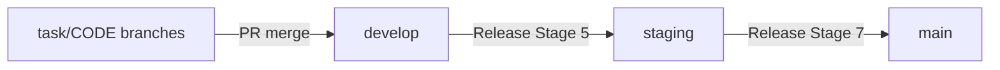

## Overview

CodeClaw is developed through its own task, release, and documentation workflow. Changes start as ideas, become tasks, land on feature branches, and are promoted through the `develop` → `staging` → `main` release line.

## Local Development Setup

### Clone and Run

```bash
git clone https://github.com/dnviti/codeclaw.git
cd codeclaw
claude --plugin-dir .
```

### Requirements

- Python 3.12+
- Claude Code CLI
- Git
- `gh` CLI for GitHub issue and PR integration testing

## Project Structure

```text
codeclaw/
├── .claude-plugin/   # Plugin manifest and marketplace metadata
├── config/           # Example JSON configuration files
├── docs/             # Generated documentation
├── hooks/            # Claude Code hook definitions
├── scripts/          # Python automation entry points
├── skills/           # Slash-command skill definitions
└── templates/       # CI/CD and project scaffolding templates
```

Active development scripts center on:
- `common.py`, `config_lock.py`, `platform_adapter.py`, `platform_exporter.py`, `platform_utils.py`
- `skill_helper.py`, `task_manager.py`, `release_manager.py`, `docs_manager.py`, `test_manager.py`, `quality_gate.py`
- `build_ccpkg.py`, `build_portable.py`, `social_announcer.py`
- `frontend_wizard.py`, `local_analyzers.py`, `ollama_manager.py`

## Coding Conventions

### Python Scripts

- Zero external dependencies for the supported core flow
- JSON output on stdout for machine-readable subcommands
- `argparse`-based CLIs with explicit subcommands
- Cross-platform behavior through `platform.system()` detection
- Idempotent operations for setup, release, and configuration helpers
- Graceful hook failure: hooks must never block Claude on errors
- NFKC normalization before matching user-supplied command strings

### Skills

- Write skill instructions in Markdown with clear headings
- Reference scripts with `${CLAW_ROOT}/scripts/` paths
- Keep prompts aligned with the current release and docs workflow

## Hook Development

Two hooks are registered in `hooks/hooks.json`:

**PreToolUse**
- Handler: `scripts/hooks/pre_tool_offload.py`
- Evaluates whether a tool call should be offloaded to Ollama
- Always exits 0 and falls back to `{"action": "proceed"}`

**PostToolUse**
- Handler: `scripts/task_manager.py hook "$CLAUDE_FILE_PATH"`
- Correlates edited files with the current in-progress task

To test hook behavior locally:

```bash
# PostToolUse
python3 scripts/task_manager.py hook "src/example.ts"

# PreToolUse
python3 scripts/hooks/pre_tool_offload.py Bash "git status"
python3 scripts/hooks/pre_tool_offload.py Bash "git push"
```

The retired hook is no longer part of the supported surface.

## Branch Strategy



- Feature branches are created per task
- `develop` receives feature work
- `staging` is the pre-release validation branch
- `main` holds production releases and tags

## Testing

### Running Tests

```bash
python3 scripts/test_manager.py discover --root /path/to/project
python3 scripts/test_manager.py analyze-gaps --root /path/to/project
python3 scripts/test_manager.py suggest --root /path/to/project
python3 scripts/test_manager.py run --root /path/to/project
```

### Coverage Tracking

```bash
python3 scripts/test_manager.py coverage snapshot --root /path/to/project
python3 scripts/test_manager.py coverage compare --root /path/to/project
python3 scripts/test_manager.py coverage threshold-check --root /path/to/project --min-coverage 80
```

## Version Management

The plugin version lives in:
- `.claude-plugin/plugin.json`
- `.claude-plugin/marketplace.json`

During releases, Stage 7d updates manifest versions after user confirmation. The docs workflow uses manifest discovery and hash-based staleness only.

## Workflow for Contributing

1. Create or pick an idea
2. Approve it into a task
3. Pick the task branch
4. Implement the change
5. Verify and close the task
6. Let `/release continue` promote the work through staging and main
