# MCP Vector Memory

The MCP Vector Memory system provides a semantic search layer over your entire codebase. It indexes source code, tasks, agent notes, and generated reports into an embedded vector database (LanceDB), then exposes that index through the Model Context Protocol (MCP) so any MCP-compatible AI assistant — Claude Code, Cursor, Continue.dev, or custom agents — can query it with natural language.

## Why Vector Memory

Traditional code search (grep, ripgrep, `Ctrl+F`) finds exact text matches. Vector memory finds _meaning_. When an agent asks "how does authentication work?", it retrieves the relevant middleware, route handlers, and configuration — even if none of them contain the word "authentication".

**Key benefits:**
- Agents understand your codebase without reading every file
- Stored learnings survive across conversations and agent sessions
- Multi-agent workflows share knowledge without re-discovering it
- Task context is assembled automatically from code, notes, and dependencies

## Architecture Overview

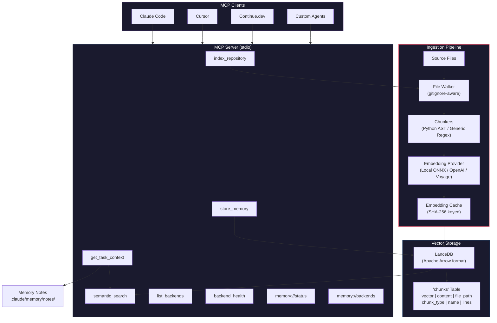

## How It Works

### Indexing Pipeline

When you run `/setup` or edit a file, the vector memory system indexes your codebase through a multi-stage pipeline:

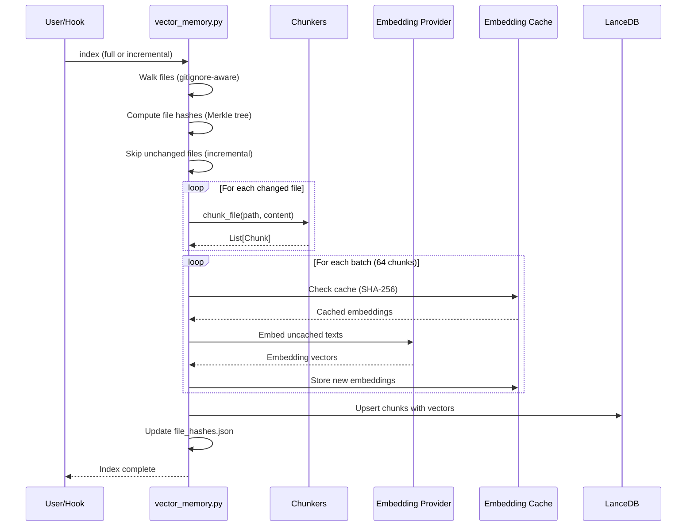

**Step 1 — File Discovery:** The file walker traverses the project tree, respecting `.gitignore` patterns and skipping binary files, `node_modules/`, `.git/`, and other non-content directories.

**Step 2 — Staleness Detection:** A Merkle hash tree (`file_hashes.json`) tracks the SHA-256 of every indexed file. During incremental indexing, only files whose hash has changed are re-processed.

**Step 3 — Chunking:** Files are split into semantic units using language-specific chunkers:

| Chunker | Languages | Strategy | Units |
|---------|-----------|----------|-------|
| Python AST | `.py` | `ast.parse()` | Functions, classes, methods, module-level blocks |
| Generic Regex | `.js`, `.ts`, `.go`, `.rs`, `.java`, etc. | Regex boundary detection | Functions, classes, blocks |
| Text/Markdown | `.md`, `.txt` | Header-based splitting | Sections (split on `#` / `##`) |

Each chunk captures:
- `content` — the source code or text
- `file_path` — relative path to the file
- `chunk_type` — `function`, `class`, `method`, `block`, `doc`
- `name` — identifier (e.g., function name)
- `start_line` / `end_line` — source location
- `language` — detected from file extension
- `file_role` — classified role (e.g., `test`, `config`, `entry_point`)
- `content_hash` — SHA-256 for deduplication

**Step 4 — Embedding:** Chunk content is converted to dense vectors. The embedding cache avoids redundant computation — identical text always produces the same embedding, and the cache persists across index rebuilds.

**Step 5 — Storage:** Chunks and their vectors are stored in a LanceDB table using Apache Arrow columnar format. LanceDB is an embedded database — no separate server process needed.

### Search Flow

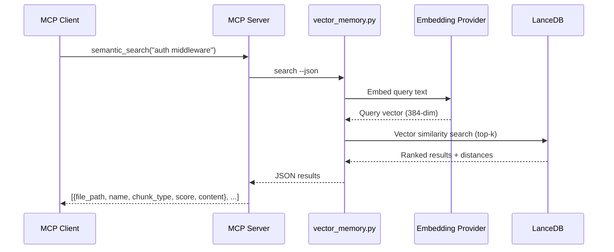

Results include a `_distance` score (lower = more relevant) and can be filtered by `file_path` substring or `chunk_type`.

### Memory Storage Flow

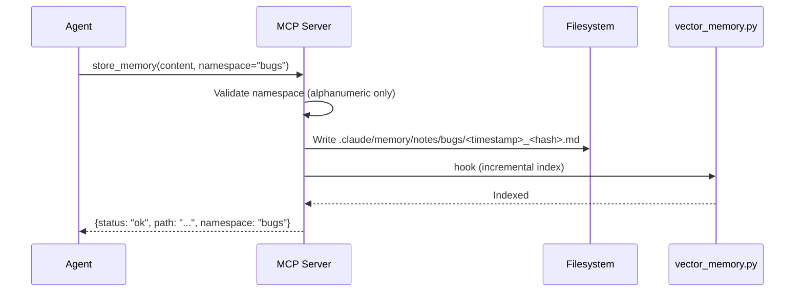

Stored notes are markdown files with optional YAML frontmatter. They are automatically indexed and become searchable via `semantic_search`.

## Installation

### Prerequisites

- Python 3.8+
- CodeClaw plugin installed in Claude Code

### Step 1 — Install Python Dependencies

```bash
pip install lancedb onnxruntime tokenizers numpy pyarrow
```

| Package | Purpose |
|---------|---------|
| `lancedb` | Embedded vector database (Apache Arrow format, zero-server) |
| `onnxruntime` | Local embedding model inference |
| `tokenizers` | Fast BPE tokenization for the embedding model |
| `numpy` | Numerical operations for embedding vectors |
| `pyarrow` | Apache Arrow support required by LanceDB |

For the MCP server, install all required packages:

```bash
pip install "mcp>=1.0" "lancedb>=0.5.0,<1.0" "sentence-transformers>=2.7.0,<3.0"
```

Alternatively, enable vector memory MCP via the `/setup` skill for automatic installation.

### Step 2 — Verify Dependencies

```bash
python3 <plugin-dir>/scripts/deps_check.py
```

Expected output when all deps are installed:

```
CodeClaw Vector Memory — Optional Dependencies
=======================================================
  [     OK] LanceDB                  (0.x.x)
  [     OK] ONNX Runtime             (1.x.x)
  [     OK] HuggingFace Tokenizers   (0.x.x)
  [     OK] PyArrow                  (1x.x.x)
  [     OK] NumPy                    (2.x.x)

GPU Acceleration
-------------------------------------------------------
  No GPU providers detected (CPU-only onnxruntime installed).
  For GPU acceleration, install the appropriate variant:
    NVIDIA:  pip install onnxruntime-gpu
    AMD:     pip install onnxruntime-rocm
    Windows: pip install onnxruntime-directml
    macOS:   pip install onnxruntime-silicon

Status: Ready for vector memory indexing.
```

### Step 3 — Initial Index

Run `/setup` in Claude Code (which triggers indexing automatically), or manually:

```bash
python3 <plugin-dir>/scripts/vector_memory.py index --force-init --root .
```

On first run, the ONNX model files (`all-MiniLM-L6-v2`, ~22 MB) are auto-downloaded to `~/.cache/claw/models/`.

### Step 4 — Configure MCP Server (Optional)

To expose vector memory to external MCP clients, add the server to your Claude Code MCP configuration:

```json
{
  "mcpServers": {
    "claw-vector-memory": {
      "command": "python3",
      "args": [
        "<plugin-dir>/scripts/mcp_server.py",
        "--root", "<project-root>"
      ],
      "env": {
        "CLAW_PROJECT_ROOT": "<project-root>"
      }
    }
  }
}
```

Check MCP SDK availability:

```bash
python3 <plugin-dir>/scripts/mcp_server.py --check
```

## Configuration

All configuration lives in `project-config.json` (searched at `.claude/project-config.json` then `config/project-config.json`).

### Vector Memory Section

```json
{
  "vector_memory": {
    "enabled": false,
    "auto_index": false,
    "embedding_provider": "local",
    "embedding_model": "all-MiniLM-L6-v2",
    "embedding_api_key_env": "",
    "chunk_size": 2000,
    "index_path": ".claude/memory/vectors",
    "batch_size": 64,
    "include_patterns": [],
    "exclude_patterns": [],
    "worktree_shared": true,
    "backend": "lancedb",
    "lock_backend": {
      "type": "file",
      "sqlite_path": ".claude/memory/locks/lock.db",
      "redis_url": "redis://localhost:6379",
      "redis_key_prefix": "claw:",
      "timeout": 30,
      "auto_renew_interval": 10
    },
    "gpu_acceleration": {
      "mode": "auto",
      "log_provider": true,
      "lib_paths": [],
      "gpu_path_allowlist": []
    },
    "search_log": {
      "enabled": false,
      "path": ".claude/memory/search_log.jsonl",
      "include_content": false,
      "max_size_mb": 10,
      "retention_days": 30
    }
  }
}
```

| Field | Default | Description |
|-------|---------|-------------|
| `enabled` | `false` | Enable/disable vector memory. **Opt-in** — enable via `/setup` or set to `true` manually |
| `auto_index` | `false` | Incremental re-index on every file write via PostToolUse hook. Enable after initial setup |
| `embedding_provider` | `"local"` | `"local"` (ONNX), `"openai"`, or `"voyage"` |
| `embedding_model` | `"all-MiniLM-L6-v2"` | Model identifier (see [Embedding Providers](#embedding-providers)) |
| `embedding_api_key_env` | `""` | Environment variable name containing the API key (for API providers) |
| `chunk_size` | `2000` | Maximum characters per chunk |
| `index_path` | `".claude/memory/vectors"` | Directory for the LanceDB vector store |
| `batch_size` | `64` | Number of chunks per embedding batch |
| `include_patterns` | `[]` | Whitelist file patterns (empty = all files) |
| `exclude_patterns` | `[]` | Additional file patterns to skip |
| `worktree_shared` | `true` | Share a single vector index across all git worktrees. When enabled, worktrees resolve the index path to the main repo root |
| `backend` | `"lancedb"` | Primary storage backend (`"lancedb"`, `"sqlite"`, or `"rlm"`) |
| `lock_backend.type` | `"file"` | Lock backend for multi-agent coordination: `"file"` (default, single-machine), `"sqlite"` (networked filesystems), `"redis"` (distributed) |
| `lock_backend.timeout` | `30` | Lock acquisition timeout in seconds |
| `lock_backend.redis_url` | `"redis://localhost:6379"` | Redis connection URL (Redis backend only, requires `pip install redis`) |
| `lock_backend.auto_renew_interval` | `10` | Auto-renewal interval in seconds for Redis locks |
| `gpu_acceleration.mode` | `"auto"` | GPU mode for local ONNX embeddings: `"auto"` (try GPU, fall back to CPU), `"gpu"` (require GPU), `"cpu"` (force CPU) |
| `gpu_acceleration.log_provider` | `true` | Log which ONNX execution provider is active on startup |
| `gpu_acceleration.lib_paths` | `[]` | Auto-discovered GPU library directories injected into `LD_LIBRARY_PATH`/`PATH` at runtime |
| `gpu_acceleration.gpu_path_allowlist` | `[]` | Restrict which directories may be added to `LD_LIBRARY_PATH`. Empty = built-in defaults (system lib dirs, CUDA, ROCm, pip site-packages) |
| `search_log.enabled` | `false` | Opt-in search query logging for debugging |
| `search_log.retention_days` | `30` | Auto-purge log entries older than N days. Logs created with `0o600` permissions |

### Memory Consistency Section

```json
{
  "memory_consistency": {
    "gc_ttl_days": 30,
    "max_index_size_mb": 500,
    "conflict_strategy": "auto",
    "enable_versioned_reads": false,
    "auto_resolve": {
      "enabled": false,
      "strategy": "single-judge",
      "provider": "ollama",
      "confidence_threshold": 0.8,
      "num_votes": 3,
      "max_auto_resolve_per_run": 10,
      "model": ""
    }
  }
}
```

| Field | Default | Description |
|-------|---------|-------------|
| `gc_ttl_days` | `30` | Garbage collection TTL for old entries |
| `max_index_size_mb` | `500` | Maximum allowed index size |
| `conflict_strategy` | `"auto"` | How to resolve multi-agent conflicts (`"auto"` applies per-category rules) |
| `enable_versioned_reads` | `false` | Enable LanceDB dataset versioning for point-in-time queries |
| `auto_resolve.enabled` | `false` | Enable automated conflict resolution via LLM judge |
| `auto_resolve.strategy` | `"single-judge"` | Resolution strategy for the conflict judge |
| `auto_resolve.provider` | `"ollama"` | LLM provider for auto-resolution |
| `auto_resolve.confidence_threshold` | `0.8` | Minimum confidence to accept an auto-resolution |
| `auto_resolve.num_votes` | `3` | Number of judge votes for consensus |
| `auto_resolve.max_auto_resolve_per_run` | `10` | Maximum conflicts to auto-resolve per GC run |

### MCP Server Section

```json
{
  "mcp_server": {
    "enabled": false,
    "transport": "stdio",
    "auto_start": false
  }
}
```

### Embedding Providers

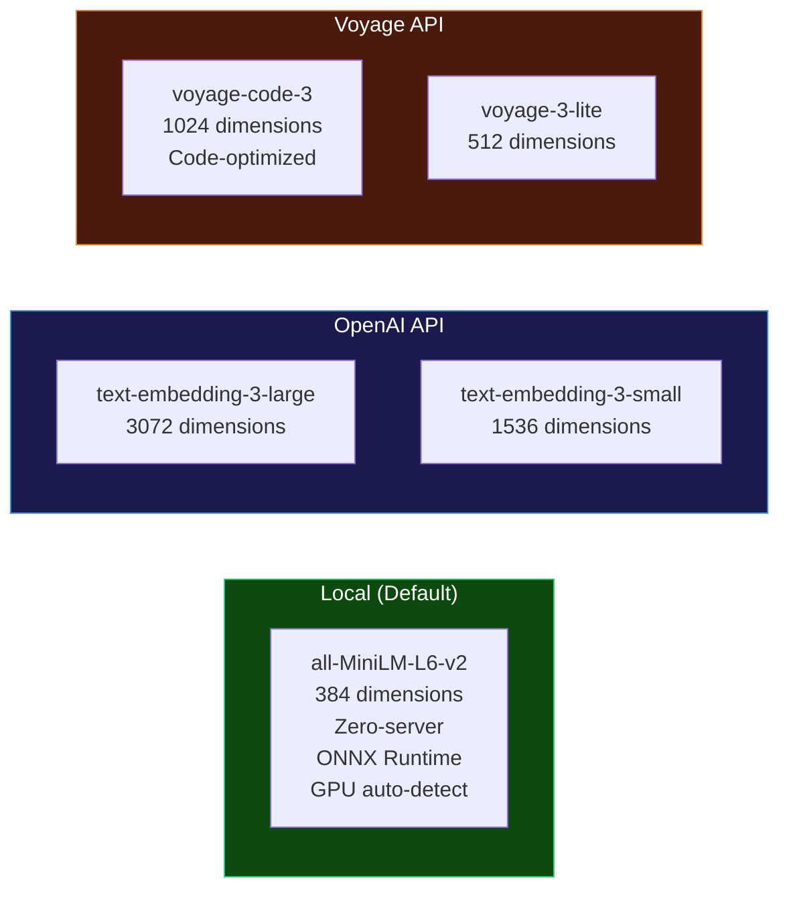

| Provider | Model | Dimensions | API Key | Best For |
|----------|-------|------------|---------|----------|
| `local` | `all-MiniLM-L6-v2` | 384 | None | Default, offline, fast |
| `openai` | `text-embedding-3-large` | 3072 | `OPENAI_API_KEY` | Highest accuracy |
| `openai` | `text-embedding-3-small` | 1536 | `OPENAI_API_KEY` | Balance of cost/quality |
| `voyage` | `voyage-code-3` | 1024 | `VOYAGE_API_KEY` | Code-optimized searches |
| `voyage` | `voyage-3-lite` | 512 | `VOYAGE_API_KEY` | Lightweight, fast |

**GPU acceleration (local provider):** The local ONNX provider auto-detects GPU execution providers in preference order: CUDA (NVIDIA) > ROCm (AMD) > CoreML (macOS) > DirectML (Windows) > OpenVINO > CPU. When `mode` is `"auto"`, the system auto-creates required GPU environment variables (e.g. `LD_LIBRARY_PATH`) and retries GPU initialization before falling back to CPU. Library paths loaded from config are validated against a `gpu_path_allowlist` for security. Configure via `gpu_acceleration.mode` in `project-config.json`. Use `python3 scripts/deps_check.py` to check available GPU providers.

**To switch providers**, update `project-config.json`:

```json
{
  "vector_memory": {
    "embedding_provider": "openai",
    "embedding_model": "text-embedding-3-large",
    "embedding_api_key_env": "OPENAI_API_KEY"
  }
}
```

Then rebuild the index:

```bash
python3 <plugin-dir>/scripts/vector_memory.py index --full --root .
```

## Implementing in a Target Repository

### Automatic Integration (Recommended)

When CodeClaw is installed as a Claude Code plugin, vector memory integrates automatically:

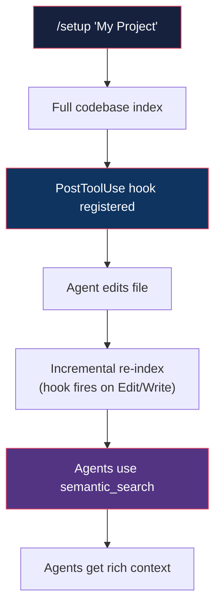

1. Run `/setup "Project Name"` — indexes the entire codebase
2. The PostToolUse hook in `hooks/hooks.json` fires on every `Edit` or `Write`:
   ```json
   {
     "matcher": "Edit|Write",
     "hooks": [{
       "type": "command",
       "command": "python3 ${CLAUDE_PLUGIN_ROOT}/scripts/vector_memory.py hook \"$CLAUDE_FILE_PATH\""
     }]
   }
   ```
3. Every file change is incrementally indexed — the index stays current

### Manual Integration

For custom setups or non-plugin installations:

**1. Copy configuration:**

```bash
cp <plugin-dir>/config/project-config.example.json .claude/project-config.json
```

**2. Build the initial index:**

```bash
python3 <plugin-dir>/scripts/vector_memory.py index --root /path/to/project
```

**3. Search from the command line:**

```bash
python3 <plugin-dir>/scripts/vector_memory.py search "database connection pooling" --root .
```

**4. Start the MCP server:**

```bash
python3 <plugin-dir>/scripts/mcp_server.py --root /path/to/project
```

### Directory Structure After Setup

```
your-project/
├── .claude/
│   ├── project-config.json          # Vector memory configuration
│   └── memory/
│       ├── vectors/
│       │   ├── lancedb/             # LanceDB vector store files
│       │   ├── embedding_cache/     # Cached embeddings (SHA-256 keyed)
│       │   ├── file_hashes.json     # Merkle tree for staleness detection
│       │   └── index_meta.json      # Index metadata and stats
│       ├── notes/                   # Agent memory storage
│       │   ├── general/             # Default namespace
│       │   ├── bugs/                # Bug-related learnings
│       │   ├── architecture/        # Architecture decisions
│       │   └── <namespace>/         # Custom namespaces
│       ├── sessions/                # Agent session tracking (JSON)
│       ├── conflicts/               # Conflict detection records
│       └── locks/                   # Advisory locks (file, SQLite, or Redis backend)
└── ...
```

## MCP Tools Reference

The MCP server exposes six tools and two resources:

### index_repository

Triggers full or incremental codebase indexing.

| Parameter | Type | Default | Description |
|-----------|------|---------|-------------|
| `path` | `string` | `"."` | Project root directory to index |
| `incremental` | `bool` | `true` | `true` = only re-index changed files; `false` = full rebuild |

```json
// Example invocation
{"tool": "index_repository", "arguments": {"path": ".", "incremental": false}}

// Response
{"status": "ok", "message": "Indexed 342 chunks from 58 files", "returncode": 0}
```

### semantic_search

Query the vector index with natural language.

| Parameter | Type | Default | Description |
|-----------|------|---------|-------------|
| `query` | `string` | (required) | Natural-language search query |
| `top_k` | `int` | `10` | Maximum number of results |
| `file_filter` | `string` | `""` | Substring filter on file paths (e.g., `"src/auth"`) |
| `type_filter` | `string` | `""` | Chunk type filter: `function`, `class`, `method`, `block`, `doc` |
| `root` | `string` | `"."` | Project root directory |

```json
// Example invocation
{"tool": "semantic_search", "arguments": {"query": "authentication middleware", "top_k": 5}}

// Response
[
  {
    "file_path": "src/middleware/auth.ts",
    "name": "verifyToken",
    "chunk_type": "function",
    "score": 0.23,
    "content": "async function verifyToken(req, res, next) { ... }"
  }
]
```

### store_memory

Persist agent learnings and discoveries for future retrieval.

| Parameter | Type | Default | Description |
|-----------|------|---------|-------------|
| `content` | `string` | (required) | Text content to store (markdown recommended) |
| `metadata` | `dict` | `null` | Optional key-value metadata (attached as YAML frontmatter) |
| `namespace` | `string` | `"general"` | Logical grouping: `"bugs"`, `"architecture"`, `"learnings"`, `"patterns"` |
| `root` | `string` | `"."` | Project root directory |

```json
// Example invocation
{
  "tool": "store_memory",
  "arguments": {
    "content": "The auth service uses RS256 JWT tokens with 15-minute expiry...",
    "namespace": "architecture",
    "metadata": {"topic": "authentication", "confidence": "high"}
  }
}

// Response
{"status": "ok", "path": ".claude/memory/notes/architecture/20260318T120000_a1b2c3d4.md", "namespace": "architecture"}
```

### get_task_context

Composite tool that assembles comprehensive context for a specific task. It performs two complementary semantic searches: a keyword-based search using the task ID and a description-based search using the full task title and description to find conceptually related code.

| Parameter | Type | Default | Description |
|-----------|------|---------|-------------|
| `task_id` | `string` | (required) | Task code (e.g., `"AUTH-0001"`) |
| `root` | `string` | `"."` | Project root directory |

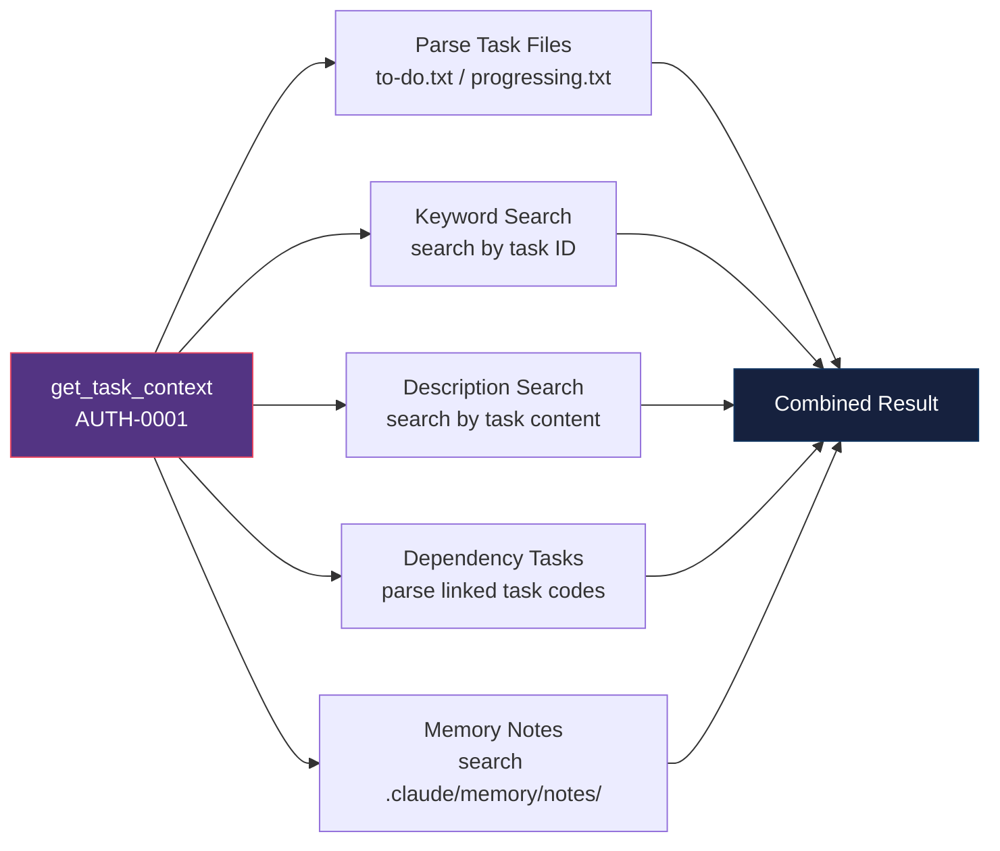

```json
// Response structure
{
  "status": "ok",
  "task": {
    "task_id": "AUTH-0001",
    "title": "User Authentication System",
    "status": "progressing",
    "priority": "HIGH",
    "dependencies": "DB-0003",
    "description": "..."
  },
  "related_code": [
    {"file_path": "src/auth/jwt.ts", "name": "signToken", "chunk_type": "function", "score": 0.18}
  ],
  "semantic_related_code": [
    {"file_path": "src/middleware/auth.ts", "name": "verifyToken", "chunk_type": "function", "score": 0.22, "language": "typescript"}
  ],
  "dependency_tasks": [
    {"task_id": "DB-0003", "title": "Database Connection Pool", "status": "done"}
  ],
  "memory_notes": [
    {"path": ".claude/memory/notes/architecture/20260315_auth.md", "namespace": "architecture", "preview": "..."}
  ]
}
```

The `related_code` field contains results from the keyword-based search (by task ID), while `semantic_related_code` contains results from the description-based search (by task content). Results in `semantic_related_code` are deduplicated by file path, keeping the best score per file.

### list_backends

Query the memory orchestrator for all configured backends and their availability.

| Parameter | Type | Default | Description |
|-----------|------|---------|-------------|
| `root` | `string` | `"."` | Project root directory |

```json
// Example response
[
  {"name": "lancedb", "configured": true, "available": true, "weight": 1.0},
  {"name": "sqlite", "configured": false, "available": false, "weight": 0.8},
  {"name": "rlm", "configured": false, "available": false, "weight": 0.6}
]
```

### backend_health

Check health status of one or all memory backends.

| Parameter | Type | Default | Description |
|-----------|------|---------|-------------|
| `backend` | `string` | `""` | Specific backend to check (`"lancedb"`, `"sqlite"`, `"rlm"`). If empty, checks all configured backends |
| `root` | `string` | `"."` | Project root directory |

```json
// Example response (all backends)
{
  "lancedb": {"status": "healthy", "index_exists": true, "total_chunks": 1247},
  "sqlite": {"status": "not_configured"}
}
```

### memory://status (Resource)

Returns current index health and available namespaces:

```json
{
  "enabled": true,
  "dependencies_installed": true,
  "index_exists": true,
  "total_chunks": 1247,
  "total_files": 89,
  "last_indexed": "2026-03-18T12:00:00Z",
  "namespaces": ["general", "bugs", "architecture"],
  "lock_backend": "file"
}
```

### memory://backends (Resource)

Returns the status of all available memory backends and the orchestrator:

```json
{
  "orchestrator_available": true,
  "backends": {
    "lancedb": {"status": "healthy"},
    "sqlite": {"status": "not_configured"}
  }
}
```

## Multi-Agent Coordination

When multiple agents work concurrently (e.g., `/task pick all`, `/release` Stage 4 PR sub-agents, or agentic fleet pipelines), the memory protocol ensures consistency.

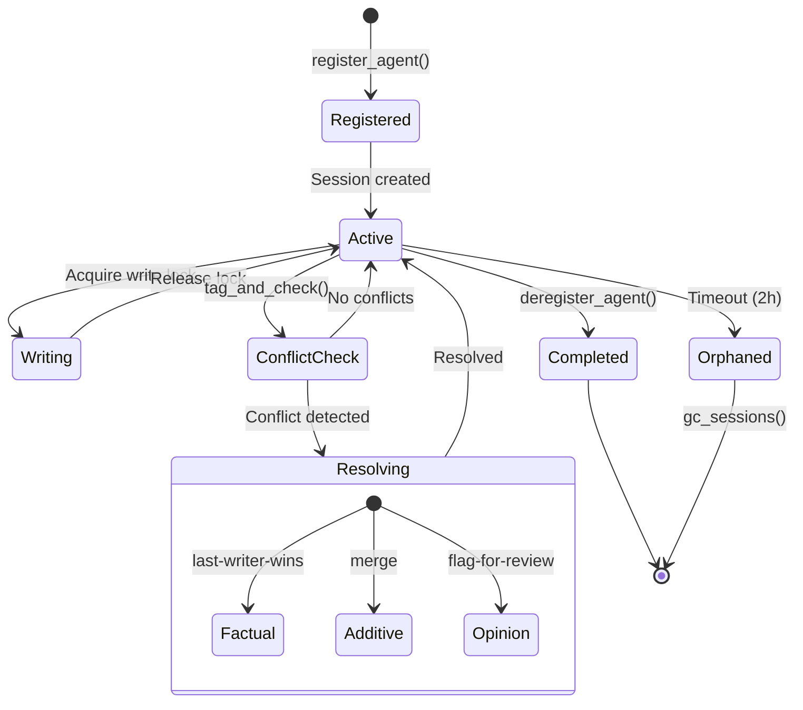

### Consistency Mechanisms

| Mechanism | Implementation | Purpose |
|-----------|---------------|---------|
| **Advisory Locking** | `memory_lock.py` — pluggable backends: `FileLockBackend` (fcntl/msvcrt, default), `SQLiteLockBackend` (WAL-mode, networked FS), `RedisLockBackend` (distributed, SET NX EX with auto-renewal) | Single-writer / multi-reader on the vector store |
| **Event Locking** | `memory_lock.EventLock` — lock-free appends with exclusive compaction locks | Optimistic concurrency for event-sourced writes |
| **Per-Backend Locks** | `memory_lock.create_backend_lock()` — separate lock files per memory backend (`vector_store`, `sqlite_store`, `rlm_store`) | Backends written independently without blocking each other |
| **Entry Tagging** | Every entry gets `agent_id`, `session_id`, `task_code`, `timestamp` | Track ownership and provenance |
| **Conflict Detection** | Compare entries on same `file_path` with different `content` | Catch contradictory writes |
| **Resolution Strategies** | Factual → last-writer-wins, Additive → merge, Opinion → flag-for-review (with optional auto-judge via LLM) | Automatic conflict handling |
| **Session Registry** | JSON files in `.claude/memory/sessions/` | Track agent lifecycles, detect orphans |
| **Versioned Reads** | LanceDB dataset versioning (optional) | Point-in-time queries |

### Conflict Resolution Strategies

| Category | Strategy | Example |
|----------|----------|---------|
| `factual` | Last-writer-wins | Code analysis results, file metadata — the latest observation is correct |
| `additive` | Merge | Discovered patterns, import lists — both contributions are valid |
| `opinion` | Flag-for-review | Architectural recommendations — contradictions need human judgment |

## CLI Reference

### Indexing

```bash
# Incremental index (default — only changed files)
python3 vector_memory.py index --root .

# Full rebuild
python3 vector_memory.py index --full --root .

# Force initialization (first-time setup)
python3 vector_memory.py index --force-init --root .
```

### Searching

```bash
# Basic semantic search
python3 vector_memory.py search "database connection pooling"

# With filters
python3 vector_memory.py search "error handling" --file-filter "src/" --type-filter "function"

# JSON output for programmatic use
python3 vector_memory.py search "auth middleware" --json --top-k 20

# Include full chunk content
python3 vector_memory.py search "auth middleware" --json --full-content
```

### Status and Maintenance

```bash
# Index health report
python3 vector_memory.py status
python3 vector_memory.py status --json

# Show/update configuration
python3 vector_memory.py configure

# Delete the entire index
python3 vector_memory.py clear --force

# Garbage collection
python3 vector_memory.py gc              # Prune old entries
python3 vector_memory.py gc --deep       # Also clear embedding cache
python3 vector_memory.py gc --ttl-days 7 # Custom TTL
```

### Worktree Sharing Verification

```bash
# Verify memory sharing from main repo
python3 vector_memory.py verify-worktree-sharing

# Verify from a worktree directory
python3 vector_memory.py verify-worktree-sharing --root .worktrees/task/AUTH-0001

# JSON output for programmatic use
python3 vector_memory.py verify-worktree-sharing --json
```

### Multi-Agent Management

```bash
# List agent sessions
python3 vector_memory.py agents
python3 vector_memory.py agents --status active
python3 vector_memory.py agents --type task

# View and resolve conflicts
python3 vector_memory.py conflicts
python3 vector_memory.py conflicts --status pending
python3 vector_memory.py conflicts --resolve <conflict-id>
```

## Use Cases

### 1. Semantic Code Discovery

**Problem:** An agent needs to find authentication-related code but doesn't know which files or function names to look for.

**Solution:** `semantic_search("authentication flow")` returns the JWT middleware, login controller, and auth config — ranked by relevance.

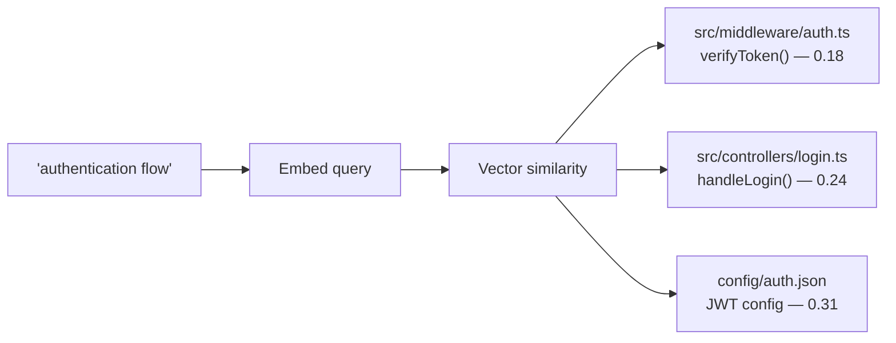

### 2. Cross-Conversation Knowledge Persistence

**Problem:** Agent A discovers that the payment service requires idempotency keys. Agent B starts a new task on the same service days later and doesn't know this.

**Solution:** Agent A stores the learning via `store_memory`. Agent B's `semantic_search("payment service constraints")` retrieves it.

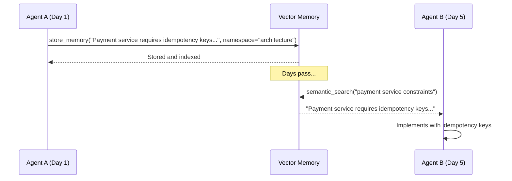

### 3. Automated Task Context Assembly

**Problem:** An agent picks up task `PERF-0012` and needs to understand the full context: what the task requires, which code is involved, what dependencies exist, and what other agents have learned.

**Solution:** `get_task_context("PERF-0012")` returns everything in one call.

### 4. Multi-Agent Parallel Development

**Problem:** During `/task pick all`, five agents work simultaneously on different tasks. They each discover things about shared components but can't coordinate.

**Solution:** The memory protocol tracks each agent's session, tags every entry with agent metadata, detects conflicts automatically, and resolves them using category-appropriate strategies.

### 5. Codebase Onboarding

**Problem:** A new team member (or a fresh AI conversation) needs to understand the project architecture quickly.

**Solution:** `semantic_search("project architecture overview")` retrieves the most relevant architectural documentation and code patterns. Combined with `memory://status` to see available knowledge namespaces.

### 6. Release Context Gathering

**Problem:** During the release pipeline (Stage 4), PR sub-agents need to understand the impact of changes across the codebase.

**Solution:** Each sub-agent uses `semantic_search` to find related code before analyzing a PR, and `store_memory` to record findings that other sub-agents can benefit from.

## Data Flow Summary

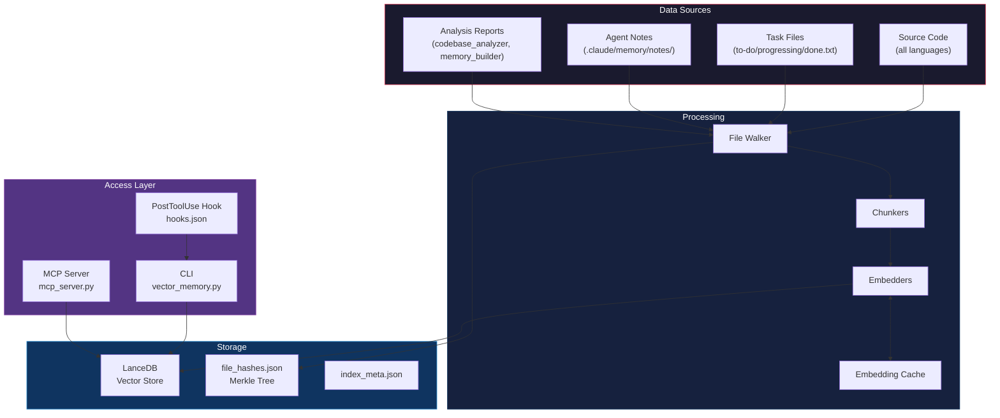

## Security Considerations

- **Filter injection prevention:** All LanceDB filter values are sanitized (single-quote escaping, semicolon/comment stripping) via `_sanitize_filter_value()`
- **Namespace validation:** `store_memory` rejects namespaces containing path traversal characters — only `[a-zA-Z0-9_-]` allowed
- **Path containment:** Stored notes verify that the resolved path stays within `.claude/memory/notes/`
- **Agent ID sanitization:** All agent identifiers are stripped of special characters before use in file paths or environment variables
- **API key handling:** API keys are read from environment variables, never stored in config files
- **Advisory locking:** Prevents concurrent write corruption, with deadlock detection at 120 seconds. Pluggable backends: file (fcntl/msvcrt), SQLite (WAL-mode for networked FS), Redis (distributed with auto-renewal). Redis URLs are validated for scheme (redis:// or rediss:// only) and passwords are redacted in status output
- **GPU path allowlist:** Library paths loaded from config into `LD_LIBRARY_PATH` are validated against a configurable allowlist (`gpu_acceleration.gpu_path_allowlist`). Overly broad patterns (`*`, `/*`) are rejected. Pip site-packages GPU directories are always permitted as a baseline
- **Search log privacy:** Search query logging is opt-in only (`search_log.enabled`). Log files are created with `0o600` permissions (owner-only). Entries are auto-purged after `retention_days`. A privacy notice in the config warns about plaintext storage of queries and file paths
- **Config file locking:** `config_lock.py` provides cross-platform atomic writes with advisory locking for `project-config.json` to prevent race conditions during parallel agent execution
- **Model download integrity:** ONNX model downloads use `urlopen` with configurable timeout, retry with exponential backoff, and basic integrity checks (file size, format validation). SSRF checks prevent downloads from private/internal networks

## Troubleshooting

### Dependencies not installed

```
Status: 3 core dependency(ies) missing.
        Vector memory features will be disabled.
```

**Fix:** `pip install lancedb onnxruntime tokenizers numpy pyarrow`

### Model download fails

```
Failed to download model.onnx from https://huggingface.co/...
```

**Fix:** Downloads now include timeout (default: 60s, configurable via `vector_memory.download_timeout`), retry with exponential backoff (3 attempts), and integrity checks. If downloads still fail:

1. Check network connectivity to `huggingface.co`
2. Download manually to `~/.cache/claw/models/all-MiniLM-L6-v2/`:
   - `model.onnx`
   - `tokenizer.json`
   - `tokenizer_config.json`
3. Validate with: `python3 scripts/vector_memory.py validate-model`

### Lock timeout

```
LockTimeoutError: Could not acquire exclusive lock on .../vector_store.lock within 30s. Holder: {...}
```

**Fix:** Check for crashed agents holding stale locks:
```bash
python3 vector_memory.py agents --status active
```
If an agent is orphaned, its lock can be force-released. The GC command also cleans up stale locks automatically:
```bash
python3 vector_memory.py gc
```

For networked filesystems where `fcntl.flock` is unreliable, switch to the SQLite lock backend:
```json
{
  "vector_memory": {
    "lock_backend": { "type": "sqlite" }
  }
}
```

### Worktree memory not shared

**Symptom:** Vector memory is empty or different when running from a worktree.

**Fix:** Verify sharing is correctly configured:
```bash
python3 vector_memory.py verify-worktree-sharing --root .worktrees/task/CODE --json
```

Ensure `worktree_shared: true` in `project-config.json` (this is the default). If sharing reports `false`, the worktree may be detached -- recreate it with `/task continue CODE`.

### Index too large

If the index exceeds `max_index_size_mb`, run garbage collection:
```bash
python3 vector_memory.py gc --deep --ttl-days 7
```

### MCP server won't start

```
Error: The 'mcp' Python package is not installed.
Install all required packages with:
  pip install "mcp>=1.0" "lancedb>=0.5.0,<1.0" "sentence-transformers>=2.7.0,<3.0"

Or enable vector memory MCP via the /setup skill for automatic installation.
```

**Fix:** `pip install "mcp>=1.0" "lancedb>=0.5.0,<1.0" "sentence-transformers>=2.7.0,<3.0"`

Or use `/setup` for automatic installation.

Verify with: `python3 <plugin-dir>/scripts/mcp_server.py --check`
